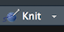

```{r setup, include=FALSE}
options(htmltools.dir.version = FALSE)

knitr::opts_chunk$set(fig.align = 'center', echo = TRUE, warning = FALSE, message = FALSE, dpi = 300, cache = TRUE, tidy = TRUE, tidy.opts = list(width.cutoff = 65), fig.align = "center", fig.width = 8, fig.height = 6, out.width = "60%") 

knitr::write_bib(c("knitr", "stringr"), "", width = 60)
```

## Agenda 

- Install R and RStudio
- Test installation
- Install some packages 
- Understand how R Markdown works 
- Read and write data in various formats 
- Brief overview of variable types and labeling values 
- Saving data 

---

## Installing R and RStudio 

First install the latest version of  from [here](https://cloud.r-project.org) 

Then install the latest version of  from [here](https://www.rstudio.com/products/rstudio/download/)

Launch RStudio and check that it shows 

> R version 3.5.0 (2018-04-23) -- "Joy in Playing"  
Copyright (C) 2018 The R Foundation for Statistical Computing

???
- Go slow and make sure everyone is able to knit 
- Minimize panic and keep the environment light 

---

## Understand your RStudio Environment 

<center></content>

???
(1) The Console ...
(2) Knitting and [Code Chunk options](https://www.rstudio.com/wp-content/uploads/2015/03/rmarkdown-reference.pdf) 

---

## Installing packages 

Open the Rmd file I sent you: **Module01.Rmd** and save it in the **code** folder 
Save the data I sent you to the **data** folder

Now we install some packages via `Tools -> Install Packages...` 

and update packages via `Tools -> Check for Package Updates...`<sup>1</sup>

```{r, eval=FALSE}
devtools, ggplot2, dplyr, reshape2, lubridate, car, Hmisc, 
gapminder, leaflet, prettydoc, DT, data.table, htmltools, 
scales, ggridges
```

Other packages will be installed as needed. 

**Note:** If you are running some code I have provided or you have found online and you get a message saying 

`Error in library(xyz) : there is no package called ‘xyz’`  

go ahead and install that library. 

.footnote[[1] It is a good idea to update packages regularly. Every now and then an update might break something  but it is usually fixed sooner rather than later by the developer.]

???
- Make sure they install `devtools` and `prettydoc` 

---

## Working directory versus Rprojects 
- Start by finding your current working directory; type `getwd()`  at the console prompt `>` and see the filepath  
- Now create a folder called **mpa5830** to store everything you will work with in this course 
- Inside **mpa5830** create two sub-folders -- (1) **code** and (2) **data**, respectively. The folder structure will now be 

```{r, eval=FALSE}
mpa5830 
  -- code 
  -- data 
```

- Create a `project` via `File -> New Project`, choose `Existing Directory`, <center></center> and browse to the  **mpa5830** folder  
- RStudio will restart and you will be in the project folder, seeing a file called `mpa5830.Rproj` 
-  Now on start every session by double-clicking this file or using RStudio's File menu: `File -> Recent Projects`        

???
- Point out that every time they start working they can click on `mpa5830.Rproj` and everything should work seamlessly unless something breaks 

---

## R Markdown files

- Go to `New File -> R Markdown ...` and enter a `My First Rmd File` in title and your `name`. 

```{r, out.width = "280", echo=FALSE}
knitr::include_graphics("../images/Rmd.png")
```

-  Click `OK`. 
- Now `File -> Save As..` and save it as `testing_rmd` in the **code** sub-folder
- Click this button:   
> You may see a message that says some packages need to be installed/updated. Allow these to be installed/updated. 

???
- Emphasize the importance of the YAML `YAML Ain't Markup Language`
- Urge patience again since some packages may have to be installed more than once, perhaps via `devtools`, and some may not have admin rights (the horror, the horror!!)
- Show them how to knit to Word and to PDF  
- Tell them you will show them how to generate a slide-deck later, if anyone is interested 

---
class: inverse, center, top

.pull-left[
... if all goes well ...

```{r, echo=FALSE, fig.height=6, fig.width=5, dev='svg', out.width = "70%"}
knitr::include_graphics("../images/img01.png")
```
]

.pull-right[

As the document knits, watch for error messages 

<center></center>
]

---

## Reading data

Make sure you have the following data-sets in the **data** folder. If you don't then the commands that follow will not work. We start by reading a simple `comma-separated variable` format file and then a `tab-delimited variable` format file. 

```{r csvtab, eval=FALSE}
df.csv = read.csv("../data/ImportDataCSV.csv", sep=",", header=TRUE) # note sep = ","
df.tab = read.csv("../data/ImportDataTAB.txt", sep="\t", header=TRUE) # note sep = "\t"
```

If the files were read then `Environment` should show objects called `df.csv` and `df.tab`. If you don't see these then check the following: 
- Make sure you have the files in your **data** folder 
- Make sure the folder has been correctly named (no blank spaces before or after, all lowercase, etc)
- Make sure the data folder is inside **mpa5830**  

???
- Point out the importance of setting the data path to `../data/filename.ext` 

---

(a) **Excel** files can be read via the `readxl` package

```{r excel, eval=FALSE}
library(readxl)
df.xls = read_excel("../data/ImportDataXLS.xls")
df.xlsx = read_excel("../data/ImportDataXLSX.xlsx")
```

(b) **SPSS, Stata, SAS** files can be read via the `haven` package

```{r others, eval=FALSE}
library(haven)
df.stata = read_stata("../data/ImportDataStata.dta")
df.sas = read_sas("../data/ImportDataSAS.sas7bdat")
df.spss = read_sav("../data/ImportDataSPSS.sav")
```

(c) It is also common to encounter **fixed-width** files where the raw data are stored without any gaps between successive variables. However, these files will come with documentation that will tell you where each variable starts and ends, along with other details about each variable. 

<center></center>

```{r dfw, eval=FALSE}
df.fw = read.fwf("../data/fwfdata.txt", widths = c(4, 9, 2, 4), header = FALSE, col.names = c("Name", "Month", "Day", "Year"))
```

Notice we need `widths = c()` and `col.names = c()`. We will wrestle with some fixed-width files in the coming weeks.  

---

## Reading Files from the Web

It is possible to specify the full web-path for a file and read it in, rather than storing a local copy. This is often useful when  updated by the source (Census Bureau, Bureau of Labor, Bureau of Economic Analysis, etc.) 

```{r readfiles, eval=FALSE}
fpe = read.table("http://data.princeton.edu/wws509/datasets/effort.dat")
test = read.table("https://stats.idre.ucla.edu/stat/data/test.txt", 
                  header = TRUE)
test.csv = read.csv("https://stats.idre.ucla.edu/stat/data/test.csv", 
                    header = TRUE)

library(foreign)
hsb2.spss = read.spss("https://stats.idre.ucla.edu/stat/data/hsb2.sav")
df.hsb2.spss = as.data.frame(hsb2.spss)
```

`hsb2.spss` was read with the `foreign` package<sup>2</sup>, an alternative to `haven` 
- `foreign` calls `read.spss` 
- `haven` calls `read_spss`

.footnote[[2] The `foreign` package will also read Stata and other formats. I end up defaulting to `haven` now. There are other packages for reading SPSS, SAS, etc. files ... `sas7bdat`, `rio`, `data.table`, `xlsx`, `XLConnect`, `gdata` and others. 
]

???

- Point out that they must have an internet connection or else the file won't be read 
- Remind them that if the source file's URL change the file may not be read, but it is easy to check if a broken URL is the source of the error by using a browser 

---

## Reading compressed files 

```{r gzip, eval=FALSE}
temp = tempfile()
download.file("ftp://ftp.cdc.gov/pub/Health_Statistics/NCHS/
              Datasets/NVSS/bridgepop/2016/pcen_v2016_y1016.sas7bdat.zip",
              temp)
oursasdata = haven::read_sas(unz(temp, "pcen_v2016_y1016.sas7bdat"))
unlink(temp)
``` 

You can save your data in a format that R will recognize, giving it the **RData** or **rdata** extension 

```{r saverd, eval=FALSE}
save(oursasdata, file = "../data/oursasdata.RData")
save(oursasdata, file = "../data/oursasdata.rdata")
```

Check your **data** directory to confirm both files are present 

---
 
## Minimal example of data processing

Working with the **hsb2** data: 200 students from the High school and Beyond study 

```{r hsbing, eval=FALSE}
hsb2 = read.table('https://stats.idre.ucla.edu/stat/data/hsb2.csv',
                  header=TRUE, sep=",")
```

- female  = (0/1) 
- race = (1=hispanic 2=asian 3=african-amer 4=white) 
- ses  = socioeconomic status (1=low 2=middle 3=high) 
- schtyp =  type of school (1=public 2=private) 
- prog   = type of program (1=general 2=academic 3=vocational) 
- read  =  standardized reading score 
- write  = standardized writing score 
- math   = standardized math score 
- science = standardized science score 
- socst = standardized social studies score 

---

```{r dt1, echo=FALSE}
hsb2 = read.table('https://stats.idre.ucla.edu/stat/data/hsb2.csv',
                  header=TRUE, sep=",")
hdf = hsb2[, c(1:7)]
library(DT)
datatable(hdf, options = list(fillContainer = FALSE, searching = FALSE, pageLength = 5))
```

---

There are no label values for the various qualitative variables (female, race, ses, schtyp, and prog) so we create these.<sup>3</sup> 

```{r hsb2clean, eval=TRUE}
hsb2$female = factor(hsb2$female, levels = c(0, 1), labels=c("Male", "Female"))
hsb2$race = factor(hsb2$race, levels = c(1:4), labels=c("Hispanic", "Asian", "African American", "White"))
hsb2$ses = factor(hsb2$ses, levels = c(1:3), labels=c("Low", "Middle", "High"))
hsb2$schtyp = factor(hsb2$schtyp, levels = c(1:2), labels=c("Public", "Private"))
hsb2$prog = factor(hsb2$prog, levels = c(1:3), labels=c("General", "Academic", "Vocational"))
```

.footnote[[3] This is just a quick run through with creating value labels; we will cover this in greater detail in a later module.
]

---

```{r hdf, echo=FALSE}
hdf = hsb2[, c(1:7)]
library(DT)
datatable(hdf, options = list(searching = FALSE, pageLength = 5))
```

#### save your work!!

Having added labels to the factors in __hsb2__ we can now save the data for later use. 

```{r hasb2saveanew}
save(hsb2, file = "../data/hsb2.RData") 
```

Let us test if this R Markdown file will  to html 

If all is good then we can `Close Project` 
- RStudio will close your project and reopen in a vanilla session 

???

- Help with any knitting problems 
- Remind them to save the Rmd before they `Close Project` 

---
## Data in packages 

Almost all R packages come bundled with data-sets, too many of them to walk you through but 
- [see here for standard ones](https://stat.ethz.ch/R-manual/R-devel/library/datasets/html/00Index.html) 
- [here are some more](https://vincentarelbundock.github.io/Rdatasets/datasets.html) 
- [and some more](http://www.public.iastate.edu/~hofmann/data_in_r_sortable.html) 

To load data from a package, if you know the data-set's name, run 

```{r datasets1}
library(HistData)
data("Galton")
names(Galton)
```

or you can run 

```{r datasets2}
data("GaltonFamilies", package = "HistData")
names(GaltonFamilies)
```


---
## Saving data and workspaces 

You can certainly save your data via 
  - `save(dataname, file = "filepath/filename.RData")` or 
  - `save(dataname, file = "filepath/filename.rdata")`

```{r, tidy=FALSE}
data(mtcars)
save(mtcars, file = "../data/mtcars.RData")
{{ rm(list = ls()) }}# To clear the Environment
load("../data/mtcars.RData")
```

You can also save multiple data files as follows: 

```{r, tidy=FALSE}
data(mtcars)
library(ggplot2)
data(diamonds)
{{ save(mtcars, diamonds, file = "../data/mydata.RData") }}
rm(list = ls()) # To clear the Environment
load("../data/mydata.RData")
```

---

If you want to save just a single `object` from the environment and then load it in a later session, maybe with a different name, then you should use `saveRDS()` and `readRDS()` 

```{r}
data(mtcars)
saveRDS(mtcars, file = "../data/mydata.RDS")
rm(list = ls()) # To clear the Environment
ourdata = readRDS("../data/mydata.RDS")
```

If instead you did the following, note that you have to did the following, the file  will be read with the name when saved 

```{r}
data(mtcars)
save(mtcars, file = "../data/mtcars.RData")
rm(list = ls())  # To clear the Environment
ourdata = load("../data/mtcars.RData") # Note ourdata is listed as "mtcars" 
```

If you want to save everything you have done in the work session you can via `save.image()` 

```{r, eval=FALSE}
save.image(file = "mywork_jan182018.RData")
```
- The next time you start RStudio this image will be automatically loaded 
- Useful if you have a lot of R code you have written and various objects generated and do not want to start from scratch the next time around. 

???

Let them know that if not in a project and they try to close RStudio after some code has been run, they will be prompted to save (or not) the  `workspace` and they should say "no" 

---

## RStudio webinars
The fantastic team at RStudio runs free webinar that are often very helpful so be sure to signup with your email. Here are some video recodgins of webinars that are relevant to what we have covered so far. 

- [Programming Part 1 (Writing code in RStudio)](https://www.rstudio.com/resources/webinars/rstudio-essentials-webinar-series-part-1/) 
- [Programming Part 2 (Debugging code in RStudio)](https://www.rstudio.com/resources/webinars/rstudio-essentials-webinar-series-programming-part-2/) 
- [Managing Change Part 1 (Projects in RStudio)](https://www.rstudio.com/resources/webinars/rstudio-essentials-webinar-series-managing-change-part-1/) 
- [Importing Data into R](https://www.rstudio.com/resources/webinars/importing-data-into-r/) 
- [Whats new with readxl](https://www.rstudio.com/resources/webinars/whats-new-with-readxl/) 
- [Getting your data into R](https://www.rstudio.com/resources/webinars/getting-your-data-into-r/) 
- [Getting Started with R Markdown](https://www.rstudio.com/resources/webinars/getting-started-with-r-markdown/)

