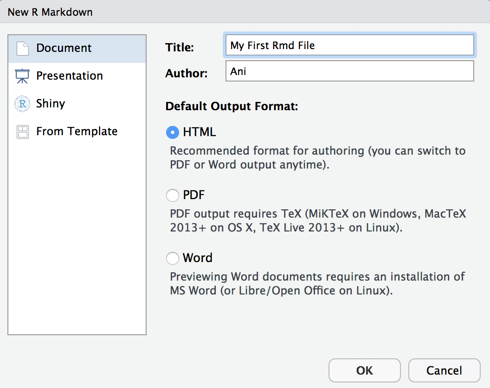
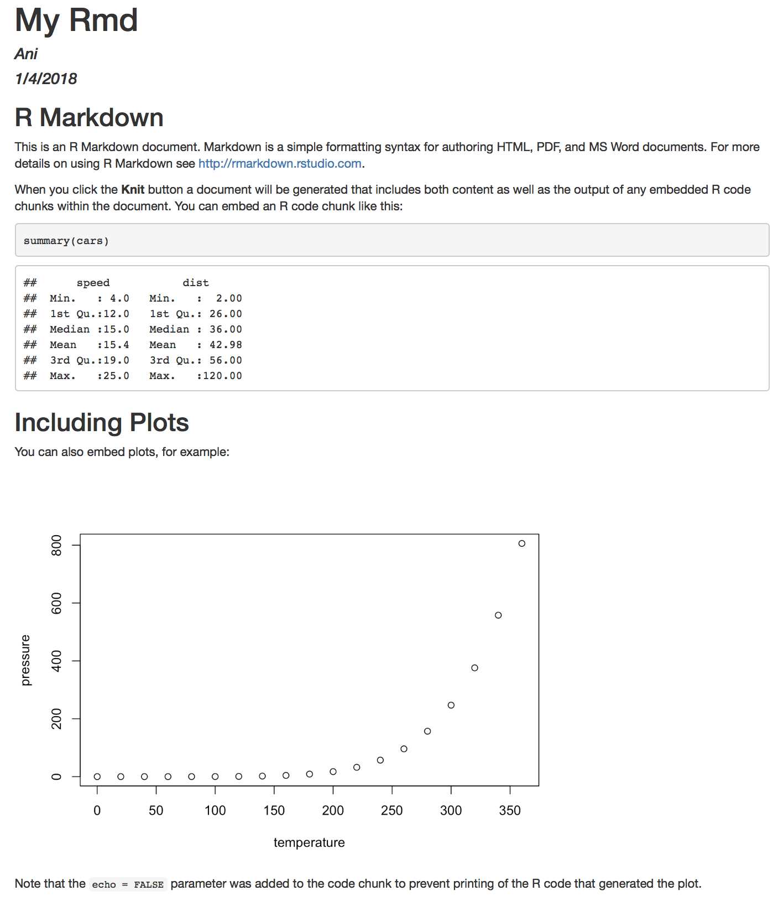

<script>
```{css}
.vembedr {
  display: inline-block;
  border-radius: 25px; /* adjust it to your needs */
  overflow: hidden;
}

.vembedr iframe {
  display: block;
  border: none;
}
```
</script>

```{r setup, include=FALSE}
knitr::opts_chunk$set(fig.align = 'center', echo = TRUE, warning = FALSE, message = FALSE, dpi = 300, cache = TRUE, tidy = TRUE, tidy.opts = list(width.cutoff = 70), fig.align = "center", fig.width = 8, fig.height = 6, out.width = "60%") 
```

## Agenda 

- Install R and RStudio
- Test installation
- Install some packages 
- Understand how R Markdown works 
- Read data in various formats 
- Basic data processing and saving 
- Fun with leaflet 


### Installing R and RStudio 

First install the latest version of  from [here](https://cloud.r-project.org) 

Then install the latest version of  from [here](https://www.rstudio.com/products/rstudio/download/)

Launch RStudio and check that it shows 

> R version 3.4.3 (2017-11-30) -- "Kite-Eating Tree"  
Copyright (C) 2017 The R Foundation for Statistical Computing

```{r video1, echo=FALSE}
library("htmltools")
library("vembedr")
embed_vimeo("97166163") %>%
  div(class = "vembedr") %>%
  div(align = "center")
```


## Understand your RStudio Environment 

```{r panes, out.width="70%", echo=FALSE}
knitr::include_graphics("./images/rstudiopanes.png")
```

(1) Console = This is where commands are issued to R, either by typing and hitting enter or running commands from a script (like your R Markdown file) 
(2) Environment = stores and shows you all the objects created 
(3) History shows you a running list of all commands issued to R 
(4) Connections = shows you any databases/servers you are connected to and also allows you to initiate a new connection 
(5) Files = shows you files and folders in your current working directory, and you can move up/down in the folder hierarchy 
(6) Plots = show you all plots that have been generated 
(7) Packages = shows you installed packages 
(8) help = allows you to get the help pages by typing in keywords 
(9) Viewer = shows you are "live" documents running on the server 
(10) Knit = allows you to generated html/pdf/word documents from a script 
(11) Insert = allows you to insert a vanilla R chunk. You can (and should) give unique name to code chunks so that you can easily diagnose which chunk is not working 
(12) Run = allows you to run lines/chunks 

You can customize the panes via `Tools -> Global Options...` 

Panes can be detached . This is very helpful when you want another application next to the pane or behind it, or if you are using multiple monitors since then you can execute commands in one monitor and watch the output in another monitor. 

You also have a spellcheck; use it to catch typos. 

## Installing packages 

Open the Rmd file I sent you: **Module01_forClass.Rmd** and save it in the **code** folder. Save the data I sent you to the **data** folder. 

Now we install some packages via `Tools -> Install Packages...` 


```{r packs, eval=FALSE}
devtools, ggplot2, dplyr, reshape2, lubridate, car, Hmisc, gapminder, leaflet, prettydoc, DT, data.table, htmltools, scales, ggridges
```

Other packages will be installed as needed 

If we need to, we could update packages via `Tools -> Check for Package Updates...` It is a good idea to update packages on a regular frequency but every now and then something might break with an update but it is usually fixed sooner rather than later by the developer.

### Working directory versus Rprojects 

(1) Start by finding your current working directory; type `getwd()`  at the `>` prompt in the `Console` and see the result 
(2) Now create a folder where you want to store everything you will read, develop, etc. in this course. I suggest you call this  folder **mpa6020** 
(3) Inside **mpa6020** create two sub-folders called **code** and **data**, respectively. The  folder structure will now be 

```{r folders, eval=FALSE}
mpa6020 
  -- code 
  -- data 
```

(4) Now create a `project` via `File -> New Project`, choose `Existing Directory`, `r knitr::include_graphics("./images/projects.png")` and browse to the  **mpa6020** folder. RStudio will restart and when it does you will be in the project folder and will see a file called `mpa6020.Rproj`


## R Markdown files

```{r video2, echo=FALSE}
embed_vimeo("178485416") %>%
  div(class = "vembedr") %>%
  div(align = "center")
```

(1) Go to `New File -> R Markdown ...` and enter a `My First Rmd File` in title and your `name`. 

```{r rmd00, out.width = "300", echo=FALSE}

```

(2)  Click `OK` 
(3) Now `File -> Save As..` and save it as `testing_rmd` in the **code** sub-folder and click   

> You may see a message that says some packages need to be installed/updated. Allow these to be installed/updated. 

If all goes well, you should see the following output: 

```{r rmd01, echo=FALSE, fig.height=6, fig.width=5, dev='svg', out.width = "70%"}

```

As the document knits, watch for error messages 

### Specific R Markdown code block commands 

You will see the code chunks have several options that could be invoked. Here are some of the more common ones we will use. 

- eval = If FALSE, knitr will not run the code in the code chunk. 
- include = If FALSE, knitr will run the chunk but not include the chunk in the final document. 
- echo = If FALSE, knitr will not display the code in the code chunk above it’s results in the final document. 
- error = If FALSE, knitr will not display any error messages generated by the code. 
- message = If FALSE, knitr will not display any messages generated by the code. 
- warning = If FALSE, knitr will not display any warning messages generated by the code. 
- cache = If TRUE, knitr will cache the results to reuse in future knits. Knitr will reuse the results until the code chunk is altered. 
- dev = The R function name that will be used as a graphical device to record plots, e.g. dev='CairoPDF'. 
- dpi = A number for knitr to use as the dots per inch (dpi) in graphics (when applicable). 
- fig.align = 'center', 'left', 'right' alignment in the knit document 
- fig.height = height of the figure (in inches, for example) 
- fig.width  = width of the figure (in inches, for example) 
- out.height, out.width = The width and height to scale plots to in the final output. 

Other options can be found in [the cheatsheet available here](https://www.rstudio.com/wp-content/uploads/2015/03/rmarkdown-reference.pdf) 
There is an excellent R Markdown in RStudio tutorial on vimeo. If the video does not show up  below (because of privacy restrictions) click on it to view it on vimeo. You may need to sign-up (for free) with an email id. 

```{r video3, echo=FALSE}
embed_vimeo("142172484") %>%
  div(class = "vembedr") %>%
  div(align = "center")
```

## Reading data

Make sure you have the data-sets sent to you via slack in the **data** folder. If you don't then the commands that follow will not work. We start by reading a simple `comma-separated variable` format file and then a `tab-delimited variable` format file. 

```{r csvtab, eval=TRUE}
df.csv = read.csv("./data/ImportDataCSV.csv", sep = ",", header = TRUE) 
df.tab = read.csv("./data/ImportDataTAB.txt", sep = "\t", header = TRUE) 
```

The `sep = ","` switch says the individual variables are separated by a comma, and `header = TRUE` switch indicates that the first row includes variable names. The tab-delimited file needs `sep = "\t"`. If both files were read then `Environment` should show objects called `df.csv` and `df.tab`. If you don't see these, check the following: 

- Make sure you have the files in your **data** folder 
- Make sure the folder has been correctly named (no blank spaces before or after, all lowercase, etc)  
- Make sure the data folder is inside **mpa6020** 

**Excel** files can be read via the `readxl` package

```{r excel, eval=TRUE}
library(readxl)
df.xls = read_excel("./data/ImportDataXLS.xls")
df.xlsx = read_excel("./data/ImportDataXLSX.xlsx")
```

**SPSS, Stata, SAS** files can be read via the `haven` package

```{r others, eval=TRUE}
library(haven)
df.stata = read_stata("./data/ImportDataStata.dta")
df.sas = read_sas("./data/ImportDataSAS.sas7bdat")
df.spss = read_sav("./data/ImportDataSPSS.sav")
```

It is also common to encounter **fixed-width** files where the raw data are stored without any gaps between successive variables. However, these files will come with documentation that will tell you where each variable starts and ends, along with other details about each variable. 

<center></center> 

```{r dfw, eval=TRUE}
df.fw = read.fwf("./data/fwfdata.txt", widths = c(4, 9, 2, 4), header = FALSE, col.names = c("Name", "Month", "Day", "Year"))
```

Notice we need `widths = c()` to indicate how many slots each variable takes and then `col.names = c()` to label the columns since the data file does not have variable names. 


### Reading Files from the Web

It is possible to specify the full web-path for a file and read it in, rather than storing a local copy. This is often useful when  updated by the source (Census Bureau, Bureau of Labor, Bureau of Economic Analysis, etc.) 

```{r readfiles, eval=TRUE}
fpe = read.table("http://data.princeton.edu/wws509/datasets/effort.dat")
test = read.table("https://stats.idre.ucla.edu/stat/data/test.txt", header = TRUE)
test.csv = read.csv("https://stats.idre.ucla.edu/stat/data/test.csv", header = TRUE)

library(foreign)
hsb2.spss = read.spss("https://stats.idre.ucla.edu/stat/data/hsb2.sav")
df.hsb2.spss = as.data.frame(hsb2.spss)
```

Note that `hsb2.spss` was read with the `foreign`, an alternative package to `haven` 

- `foreign` calls `read.spss` 
- `haven` calls `read_spss`

The `foreign` package will also read Stata and other formats and was the  one I used a lot before defaulting to `haven` now. There are other packages for reading SAS, SPSS,  etc. data files -- `sas7bdat`, `rio`, `data.table`, `xlsx`, `XLConnect`, `gdata`, etc. 


### Reading compressed files 
Large files may sit in compressed archives on the web and R has a neat way of allowing you to download the file, unzip it, and read it. Why is this useful? Because if these files tend to be update periodicially, this ability lets you use the same piece of R code to download/unzip/read the updated file. The tedious way would be to manually download, unzip, place in the appropriate data folder, and then read it.

```{r gzip, eval=TRUE}
temp = tempfile()
download.file("ftp://ftp.cdc.gov/pub/Health_Statistics/NCHS/Datasets/NVSS/bridgepop/2016/pcen_v2016_y1016.sas7bdat.zip", temp)
oursasdata = haven::read_sas(unz(temp, "pcen_v2016_y1016.sas7bdat"))
unlink(temp)
``` 

You can save your data in a format that R will recognize, giving it the **RData** or **rdata** extension 

```{r saverd, eval=TRUE}
save(oursasdata, file = "./data/oursasdata.RData")
save(oursasdata, file = "./data/oursasdata.rdata")
```

Check your **data** directory to confirm both files are present 

## Minimal example of data processing

Working with the **hsb2** data: 200 students from the High school and Beyond study 

```{r hsbing, eval=FALSE}
hsb2 = read.table('https://stats.idre.ucla.edu/stat/data/hsb2.csv', header=TRUE, sep=",")
```

- female  = (0/1) 
- race = (1=hispanic 2=asian 3=african-amer 4=white) 
- ses  = socioeconomic status (1=low 2=middle 3=high) 
- schtyp =  type of school (1=public 2=private) 
- prog   = type of program (1=general 2=academic 3=vocational) 
- read  =  standardized reading score 
- write  = standardized writing score 
- math   = standardized math score 
- science = standardized science score 
- socst = standardized social studies score 

```{r dt1, echo=FALSE}
hsb2 = read.table('https://stats.idre.ucla.edu/stat/data/hsb2.csv', header=TRUE, sep=",")
hdf = hsb2[, c(1:7)]
library(DT)
datatable(hdf, options = list(fillContainer = FALSE, searching = FALSE, pageLength = 5))
```

There are no value labels for the various qualitative/categorical variables (female, race, ses, schtyp, and prog) so we next create these. 

```{r hsb2clean, eval=FALSE}
hsb2$female = factor(hsb2$female, levels = c(0, 1), labels=c("Male", "Female"))
hsb2$race = factor(hsb2$race, levels = c(1:4), labels=c("Hispanic", "Asian", "African American", "White"))
hsb2$ses = factor(hsb2$ses, levels = c(1:3), labels=c("Low", "Middle", "High"))
hsb2$schtyp = factor(hsb2$schtyp, levels = c(1:2), labels=c("Public", "Private"))
hsb2$prog = factor(hsb2$prog, levels = c(1:3), labels=c("General", "Academic", "Vocational"))
```

I am overwriting each variable, indicating to R that variable `x` will show up as numeric with values 0 and 1, and that a 0 should be treated as male and a 1 as female, and so on. There are are four values for race, 3 for ses, 2 for schtyp, and 3 for prog, so the mapping has to reflect this. Note that this is just a quick run through with creating value labels; we will cover this in greater detail in a later module. 

**save your work!!**

Having added labels to the factors in __hsb2__ we can now save the data for later use. 

```{r hasb2saveanew, eval=TRUE}
save(hsb2, file="./data/hsb2.RData") 
```

Let us test if this R Markdown file will  to html. If all is good then we can `Close Project`, and when we do so, RStudio will close the project and reopen in a vanilla session.  

### Data in packages 

Almost all R packages come bundled with data-sets, too many of them to walk you through but 

- [see here for standard ones](https://stat.ethz.ch/R-manual/R-devel/library/datasets/html/00Index.html) 
- [here are some more](https://vincentarelbundock.github.io/Rdatasets/datasets.html) 
- [and some more](http://www.public.iastate.edu/~hofmann/data_in_r_sortable.html) 

To load data from a package, if you know the data-set's name, run 

```{r dataset1}
library(HistData)
data("Galton")
names(Galton)
```

or you can run 

```{r dataset2}
data("GaltonFamilies", package = "HistData")
names(GaltonFamilies)
```

### Saving data and workspaces 
You can save your data via 

  - `save(dataname, file = "filepath/filename.RData")` or 
  - `save(dataname, file = "filepath/filename.rdata")`

```{r mysave1, eval=FALSE}
data(mtcars)
save(mtcars, file = "./data/mtcars.RData")
rm(list = ls()) # To clear the Environment
load("./data/mtcars.RData")
```

You can also save multiple data files as follows: 

```{r mysave2, eval=FALSE}
data(mtcars)
library(ggplot2)
data(diamonds)
save(mtcars, diamonds, file = "./data/mydata.RData") 
rm(list = ls()) # To clear the Environment
load("./data/mydata.RData")
```

If you want to save just a single `object` from the environment and then load it in a later session, maybe with a different name, then you should use `saveRDS()` and `readRDS()` 

```{r saverds}
data(mtcars)
saveRDS(mtcars, file = "./data/mydata.RDS")
rm(list = ls()) # To clear the Environment
ourdata = readRDS("./data/mydata.RDS")
```

If instead you did the following, the file will be read with the name when saved 

```{r load}
data(mtcars)
save(mtcars, file = "./data/mtcars.RData")
rm(list = ls())  # To clear the Environment
ourdata = load("./data/mtcars.RData") # Note ourdata is listed as "mtcars" 
```

If you want to save everything you have done in the work session you can via `save.image()` 

```{r saveimg, eval=FALSE}
save.image(file = "mywork_jan182018.RData")
```

The next time you start RStudio this image will be automatically loaded. This is useful if you have a lot of R code you have written and various objects generated and do not want to start from scratch the next time around. 

If you are not in a project and they try to close RStudio after some code has been run, you will be prompted to save (or not) the  `workspace` and you should say "no" by default unless you want to save the workspace. 

# A Small Map with Leaflet
There are several packages that allow us to build simple versus complicated maps in R. Of late I have been really fascinated by `leaflet` -- an easy to learn JavaScript library that generates interactive maps -- so let us see that package in action. Later on, when we move to more advanced visualizations we will look at a variety of mapping options. For the moment we keep it simple and fun. 

```{r leaf1}
library(leaflet)
library(leaflet.extras)
library(widgetframe)

m1 <- leaflet() %>% setView(lat = 39.322577, lng = -82.106336, zoom = 14) %>% 
  addTiles() %>% setMapWidgetStyle() %>%
  frameWidget(height = '275')
# saveWidget(m1, 'leaflet.html')
m1
```

Notice how this was built: 

- Use `setView()` to center the map with given latitude and longitude and then pick a reasonable zoom factor with `zoom =`. If you set the zoom factor too low you will be seeing the place from outer space and if too high then you might standing on a street corner, so experiment with it. 

Now, say since I ended up picking the general area around Richland Avenue, I could drop a marker on Building 21 on The Ridges. This is being done with `addMarkers` and the `popup` is basically reflecting what should be displayed when someone clicks on this marker.  

```{r leaf2}
m2 <- leaflet() %>% setView(lat = 39.322577, lng = -82.106336, zoom = 15) %>% 
  addMarkers(lat = 39.319984, lng = -82.107084, popup = c("The Ridges, Building 21")) %>% 
  addTiles() %>% setMapWidgetStyle() %>%
  frameWidget(height = '275')
# saveWidget(m2, 'leaflet2.html')
m2
```

# RStudio webinars
The fantastic team at RStudio runs free webinar that are often very helpful so be sure to signup with your email. Here are some video recodgins of webinars that are relevant to what we have covered so far. 
- [Programming Part 1 (Writing code in RStudio)](https://www.rstudio.com/resources/webinars/rstudio-essentials-webinar-series-part-1/) 
- [Programming Part 2 (Debugging code in RStudio)](https://www.rstudio.com/resources/webinars/rstudio-essentials-webinar-series-programming-part-2/) 
- [Managing Change Part 1 (Projects in RStudio)](https://www.rstudio.com/resources/webinars/rstudio-essentials-webinar-series-managing-change-part-1/) 
- [Importing Data into R](https://www.rstudio.com/resources/webinars/importing-data-into-r/) 
- [Whats new with readxl](https://www.rstudio.com/resources/webinars/whats-new-with-readxl/) 
- [Getting your data into R](https://www.rstudio.com/resources/webinars/getting-your-data-into-r/) 
- [Getting Started with R Markdown](https://www.rstudio.com/resources/webinars/getting-started-with-r-markdown/)

---------------

## Exercises for practice 

### Ex. 1: Creating and knitting a new RMarkdown file

Open a fresh session by launching RStudio and then running `File -> Open Project...`  

Give it a title, your name as the author, and then save it with in **code** with the following name:  `m1ex1.Rmd`  

Delete all content after the following code chunk  

```{r, out.width = "50%", echo=FALSE}

```

Add this level 1 heading `The Starwars Data` and then insert your first code chunk *exactly as shown below* 

```{r ex1a, eval = FALSE}
library(dplyr)
data(starwars)
str(starwars)
```

Add this level 2 heading `Character  Heights and Weights` and then your second code chunk 

```{r ex1b, eval=FALSE}
plot(starwars$height, plot$mass)
```

Now knit this file to **html** 


### Ex. 2: Lorem Ipsum paragraphs and graphs 

Go to [this website](https://loremipsumgenerator.com/generator/?n=2&t=p) and generate five Lorem Ipsum placeholder text paragraphs 

  - para 1: must have level 1 heading 
  - para 2: must have level 2 heading 
  - para 3: must have level 3 heading 
  - para 4: must have level 4 heading 
  - para 5: must have level 5 heading 

Using the `starwars` data, create five code chunks, one after each paragraph 

  - Each code chunk will have the same R code (see below)

```{r ex1c, eval=FALSE}
plot(starwars$height, plot$mass)
```

Now knit this file to **html** 


### Ex. 3: Reading in three data files 

Create a new `RMarkdown` file that is blank after the `initial setup code chunk` 

Insert a code chunk that reads in both these files found on the web 

- `http://www.stata.com/data/jwooldridge/eacsap/mroz.dta` 
- `http://calcnet.mth.cmich.edu/org/spss/V16_materials/DataSets_v16/airline_passengers.sav` 

In a follow-up code chunk, run the `summary()` command on each data-set 

In a separate code chunk, read in [this dataset](https://s3.amazonaws.com/tripdata/201502-citibike-tripdata.zip) after you download it and save the unzipped file in your **data** folder. 

- The variable `gender` has the following codes: `Zero = unknown; 1 = male; 2 = female` 
- Use this coding scheme to convert `gender` into a `factor` with these value labels 

In a follow-up chunk run both the following commands on this data-set 

- `names()` 
- `str()` 
- `summary()` 

In a final chunk, run the commands necessary to save each of the three data-sets as separate `RData` files. Make sure you save them in your **data** folder. 

Now knit the complete `Rmd` file to **html** 

#### Ex. 4: Knitting with prettydoc 

I'd like you to use a specific R Markdown format because the  resulting html files are very readable 

You had installed the `prettydoc` package so now create a prettydoc Rmd file as shown below: 

<center> </center>

Now take all the text and code chunk you created in Ex. 3 and insert it in this file. Make sure you add a title, etc in the `YAML` and then knit the file to `html` 

You can play with the `theme:` and `highlight:` fields, choosing from the options [displayed here](http://yixuan.cos.name/prettydoc/themes.html)
 
You should consider using the `prettydoc` format unless you want to experiment with other R Markdown templates in RStudio. 


