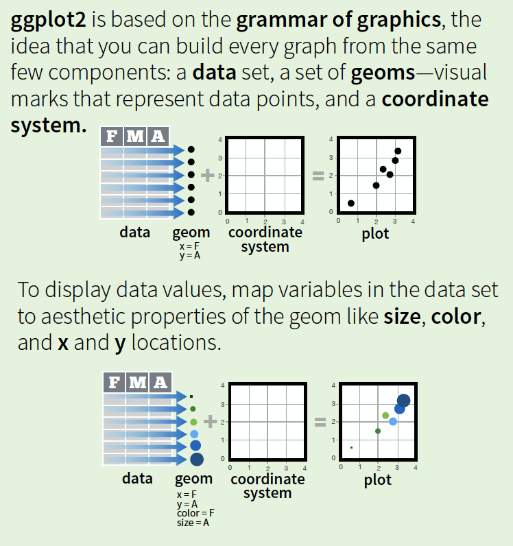

```{r setup, include=FALSE}
knitr::opts_chunk$set(fig.align = 'center', echo = TRUE, warning = FALSE, message = FALSE, dpi = 600, cache = TRUE, tidy = TRUE, tidy.opts = list(width.cutoff = 60), fig.align = "center", fig.width = 10, fig.height = 8, out.width = "65%", dev = 'svg') 
```

# Agenda 
Our goal in this module is to understand some basic ways of visualizing data. We will skip base R commands and instead just work with `ggplot2`, the most popular visualization package in the R universe. 

Remember the basic options... 

- one qualitative/categorical variables: `bar-chart` 
- one quantitative/continuous variables: `histogram/box-plot/area-chart`  
- two quantitative/continuous variables: `scatter-plot/hex-bin` 

# Two data-sets

I will use two data-sets, the first being this [IMDB data-set](http://imdb.com/)

> The internet movie database, http://imdb.com/, is a website devoted to collecting movie data supplied by studios and fans. It claims to be the biggest movie database on the web and is run by amazon. More about information imdb.com can be found online, http://imdb.com/help/show_ leaf?about, including information about the data collection process, http://imdb.com/help/show_leaf?infosource.

```{r}
library(ggplot2movies)
```

A data frame with 28819 rows and 24 variables 

- title. Title of the movie. 
- year. Year of release. 
- budget. Total budget (if known) in US dollars 
- length. Length in minutes. 
- rating. Average IMDB user rating. 
- votes. Number of IMDB users who rated this movie. 
- r1-10. Multiplying by ten gives percentile (to nearest 10%) of users who rated this movie a 1. 
- mpaa. MPAA rating (missing for a lot of movies) 
- action, animation, comedy, drama, documentary, romance, short. Binary variables representing if movie was classified as belonging to that genre. 

The second data-set is the [Star Wars dataset](https://swapi.co), a `tibble` with 87 rows and 13 variables:

```{r}
library(dplyr)
data(starwars)
```

- name: Name of the character 
- height: Height (cm)
- mass: Weight (kg)
- hair_color,skin_color,eye_color: Hair, skin, and eye colors
- birth_year: Year born (BBY = Before Battle of Yavin)
- gender: male, female, hermaphrodite, or none.
- homeworld: Name of homeworld
- species: Name of species
- films: List of films the character appeared in
- vehicles: List of vehicles the character has piloted
- starships: List of starships the character has piloted

a `tibble` you say? 

# dataframes vs. tibbles
R's default is to store a `dataframe`, as shown below with a small example and there is a tendency to convert characters into factors, change column names, etc. 

```{r df}
adf = data.frame(`Some Letters` = c("A", "B", "C"), 
                 `Some Numbers` = c(1, 2, 3))
str(adf)
print(adf)
```

`tibbles` is the brainchild of the team behind a bundle of packages (and RStudio) called the `tidyverse` that drop R's bad habits 

```{r tib}
library(dplyr)
atib = tibble(`Some Letters` = c("A", "B", "C"), 
              `Some Numbers` = c(1, 2, 3))
glimpse(atib)
print(atib)
```

There are other advantages to tibbles that we will encounter at a later stage. 

# `ggplot2` and the [grammar of graphics](http://vita.had.co.nz/papers/layered-grammar.html)

<center></center>

`qplot` will generate a quick plot but `ggplot2` is the way to go so we build with it. Read the relevant chapter on the grammar of graphics from the link in the syllabus or then [watch this video](https://vimeo.com/223812632). 

```{r gg000}
library(ggplot2)
ggplot(data = starwars)
```

Nothing results since we have not specified how we want the variable(s) to be `mapped` to the coordinate system... what variable should go on what axis? 

```{r gg001}
ggplot(data = starwars, mapping = aes(x = eye_color)) 
```

Now we are getting somewhere. We see the canvas with the specific eye colors on the x-axis but nothing else has been drawn since we have not specified the `geometry` ... do you want a bar-chart? histogram? dot-plot? line-chart? what?? 

With a categorical variable the bar-chart would be appropriate and so we ask for a `geom_bar()` 

```{r gg002}
ggplot(data = starwars, mapping = aes(x = eye_color)) + geom_bar()
ggplot(data = starwars, aes(x = eye_color)) + geom_bar()
```

Other `aesthetics` can be added, such as `group`, `color`, `fill`, `size`, `alpha` , axis labels, plot title/subtitle etc. 

There are two commands for adding a color scheme -- `color` or `colour` versus `fill`

```{r col1}
ggplot(data = starwars, mapping = aes(x = eye_color, colour = eye_color)) + geom_bar() + labs(x = "Eye Color", y = "Frequency (n)", title = "Bar-chart of Eye Color", subtitle = "(of Star Wars characters)")
```

Note what `colour = ` generated for us, and how this differs from `fill = ` (see below). 

```{r col2}
ggplot(data = starwars, mapping = aes(x = eye_color, fill = eye_color)) + geom_bar() + labs(x = "Eye Color", y = "Frequency", title = "Bar-chart of Eye Color", subtitle = "(of Star Wars characters)")
```

Of course, it would be good to have the colors match the eye-color so let us do that next. 

```{r col3}
mycolors = c("black", "blue", "slategray", "brown", "gray34", "gold", "greenyellow", "navajowhite1", "orange", "pink", "red", "magenta", "thistle3", "white", "yellow")
ggplot(data = starwars, mapping = aes(x = eye_color)) + geom_bar(fill = mycolors) + labs(x = "Eye Color", y = "Frequency", title = "Bar-chart of Eye Color", subtitle = "(of Star Wars characters)")
```

R Colors used from are [this source](http://www.stat.columbia.edu/~tzheng/files/Rcolor.pdf) but see also [this source](https://www.nceas.ucsb.edu/~frazier/RSpatialGuides/colorPaletteCheatsheet.pdf). Colors can be customized by generating your own palettes via the [Color Brewer here](http://colorbrewer2.org/#type=sequential&scheme=YlGnBu&n=3). But don't get carried away: Remember to read the materials on choosing colors wisely, particularly the point about qualitative palettes, divergent palettes, and then palettes that work well even with colorblind audiences.

I'll switch to a different variable and show you how to use prebuilt color palettes. 

```{r colfillb}
ggplot(data = starwars, mapping = aes(x = gender)) + geom_bar(aes(fill = gender)) + labs(x = "Gender", y = "Frequency", title = "Bar-chart of Gender", subttitle = "(of Star Wars characters)", caption = "(Source: The dplyr package)") + scale_fill_brewer(palette = "Pastel1")

ggplot(data = starwars, mapping = aes(x = gender)) + geom_bar(aes(fill = gender)) + labs(x = "Gender", y = "Frequency", title = "Bar-chart of Gender", subttitle = "(of Star Wars characters)", caption = "(Source: The dplyr package)") + scale_fill_brewer(palette = "Set1")
```

```{r colfillm}
library(ggplot2)
library(wesanderson)
ggplot(data = starwars, mapping = aes(x = gender)) + geom_bar(aes(fill = gender)) + labs(x = "Gender", y = "Frequency", title = "Bar-chart of Gender", subtitle = "(of Star Wars characters)", caption = "(Source: The dplyr package)") + scale_fill_manual(values = wes_palette("Darjeeling1"))
```

```{r practice1}
ggplot(data = starwars, aes(x = homeworld)) + geom_bar()
ggplot(data = starwars, aes(x = species)) + geom_bar()
ggplot(data = starwars, aes(x = gender)) + geom_bar()
```

Now add labels, a title, subtitle

```{r practice2}
ggplot(data = starwars, aes(x = gender)) + geom_bar() + labs(x = "Gender", y = "Frequency", title = "Bar-chart of Gender", subtitle = "(of Star Wars characters)", caption = "(Source: The dplyr package)")

```


Study the commands carefully and note that 

- `scale_fill_brewer` is being used in the first plot, calling on built-in color palettes. You can [review them here](http://ggplot2.tidyverse.org/reference/scale_brewer.html) 
- `scale_fill_manual` is being used in the second plot and a specific palette is being invoked from [the wesanderson package](https://github.com/karthik/wesanderson) 


Color palettes will come into play far more later on in this course. 

## Themes 
One can also lean on various plotting themes as shown below. 

```{r, out.width = "70%"}
library(ggthemes)
p1 = ggplot(data = starwars, mapping = aes(x = eye_color)) + geom_bar() +  theme_tufte() + theme(axis.text.x = element_text(size = 6)) 
p2 = ggplot(data = starwars, mapping = aes(x = eye_color)) + geom_bar() + theme_solarized() + theme(axis.text.x = element_text(size = 6)) 
p3 = ggplot(data = starwars, mapping = aes(x = eye_color)) + geom_bar() + theme_economist() + theme(axis.text.x = element_text(size = 6)) 
p4 = ggplot(data = starwars, mapping = aes(x = eye_color)) + geom_bar() +  theme_fivethirtyeight() + theme(axis.text.x = element_text(size = 6)) 
library(patchwork)
p1 + p2 + p3 + p4 + plot_layout(ncol = 2)
```

Later on you will learn these & other ways to build advanced visualizations ...for now we get to work more with `ggplot2`. 

## More with bar-charts

```{r bar01}
library(ggplot2movies)
ggplot(data = movies, aes(x = mpaa)) + geom_bar() + theme_minimal()
```

```{r bar02}
library(ggplot2)
ggplot(data = movies) + geom_bar(aes(x = mpaa)) + theme_minimal()
```

Notice that we switched the `aes()` piece of the code but that made no difference; this is important to bear in mind because it will come in handy down the road when we need to build some advanced visualizations. 

The plot is sub-optimal since MPAA ratings are missing for a lot of movies and should be  eliminated from the plot via `subset(mpa != "")`  

```{r bar2}
str(movies$mpaa)
ggplot(subset(movies, mpaa != ""), aes(x = mpaa)) + geom_bar() + theme_minimal()
```

The order of the bars is fortuitous in that it goes from the smallest frequency to the highest frequency, drawing the reader's eye. I said fortuitous because the default is to order the bars in an ascending alphabetic/alphanumeric order if the variable is a **character**. See below for an example. 

```{r bar3}
library(dplyr)
df = tibble(x = c(rep("A", 2), rep("B", 4), rep("C", 1)))
ggplot(data = df, aes(x = x)) + geom_bar() + theme_minimal()
```

Later on we'll learn how to order the bars with ascending/descending frequencies or by some other logic. 

What about plotting the `relative frequencies` on the y-axis rather than the frequencies? 

```{r bar4}
library(dplyr) 
library(ggplot2movies) 
library(scales)
library(ggplot2)
ggplot(data = subset(movies, mpaa != ""), aes(x = mpaa, y = (..count..)/sum(..count..))) + geom_bar() + scale_y_continuous(labels = scales::percent) + xlab("MPAA Rating") + ylab("Relative Frequency (%)") + theme_minimal() 
```

Note the addition of 

- `y = (..count..)/sum(..count..)` 
- `scale_y_continuous(labels = scales::percent)` 

We could also add a second or even a third/fourth categorical variable. Let us see this with our `hsb2` data-set. we can start by reading in the data file. 

```{r bar5}
load("./data/hsb2.RData")
colnames(hsb2) = tolower(colnames(hsb2)) 
ggplot(data = hsb2, aes(x = ses, group = female)) + geom_bar(aes(fill = female)) + theme_minimal()
```

This is not very useful since the viewer has to estimate the relative sizes of the two colors within any given bar. That can be fixed with `position = "dodge"`, juxtaposing the bars for the groups as a result, and the end product is much better. 

```{r bar6}
ggplot(data = hsb2, aes(x = ses, group = female)) + geom_bar(aes(fill = female), position = "dodge") + theme_minimal()
```

This is fine if you want to know what percent of the 200 students are low SES males, low SES females, etc. What if you wanted to calculate percentages within each sex? 

```{r bar7}
ggplot(data = hsb2, aes(x = ses, y = female)) + geom_bar(aes(group = female, fill = female, y = ..prop..), position = "dodge") + scale_y_continuous(labels = scales::percent) + ylab("Relative Frequency (%)") + xlab("Socioeconomic Status Groups") + theme_minimal()
```

What about within each ses? 

```{r bar8}
ggplot(data = hsb2, aes(x = female, y = ses)) + geom_bar(aes(group = ses, fill = ses, y = ..prop..), position = "dodge") + scale_y_continuous(labels = scales::percent) + ylab("Relative Frequency (%)") + xlab("Socioeconomic Status Groups") + theme_minimal()
```

## Histograms 

If you've forgotten what these are, see [histogram](http://tinlizzie.org/histograms/), or then [Yau's piece here](https://flowingdata.com/2014/02/27/how-to-read-histograms-and-use-them-in-r/) and [here](https://flowingdata.com/2017/06/07/how-histograms-work/). [There is a short video available as well](https://vimeo.com/221607341). 

Let us load the `hsb2` data we had downloaded, processed (adding value labels to categorical variables) and saved in our **data** folder in the last module. 

```{r loading}
load("./data/hsb2.RData")
```

For histograms in ggplot2, `geom_histogram()` does the trick but note that the default number of bins is not very useful and can be tweaked, along with other embellishments. 

```{r gg2a}
ggplot(data = hsb2, aes(x=read)) + geom_histogram(fill="cornflowerblue", color = "white") + ggtitle("Histogram of Reading Scores") + xlab("Reading Score") + ylab("Frequency") + theme_minimal()
```

We could set `bins = 5` and we could also experiment with `binwidth =`

```{r gg2b}
ggplot(data = hsb2, aes(x=read)) + geom_histogram(fill="cornflowerblue", color = "white", bins = 5) + ggtitle("Histogram of Reading Scores") + xlab("Reading Score") + ylab("Frequency") + theme_minimal()
```

```{r gg2c}
ggplot(data = hsb2, aes(x=read)) + geom_histogram(fill="cornflowerblue", color = "white", binwidth = 10) + ggtitle("Histogram of Reading Scores") + xlab("Reading Score") + ylab("Frequency") + theme_minimal()
```

If we wanted to break out the histogram by one or more categorical variables, we could do so quite easily: 

```{r gg3}
ggplot(hsb2, aes(x = read)) + geom_histogram(fill="cornflowerblue", bins = 5, color = "white") + ggtitle("Histogram of Reading Scores") + xlab("Reading Score") + ylab("Frequency") + facet_wrap(~ female) + theme_minimal()
```

Or better yet, 

```{r gg4}
ggplot(hsb2, aes(x = read)) + geom_histogram(fill="cornflowerblue", bins = 10, color = "white") + ggtitle("Histogram of Reading Scores") + xlab("Reading Score") + ylab("Frequency") + facet_wrap(~ female, ncol = 1) + theme_minimal()
```

since now the distributions are stacked above each, easing comparisons. 

One useful design element with breakouts is placing in relief the consolidated data (i.e., the distribution without break-outs). 

```{r gg4context}
ggplot(data = hsb2, aes(x = read, fill = female)) + geom_histogram(bins = 10, color = "white") + ggtitle("Histogram of Reading Scores") + xlab("Reading Score") + ylab("Frequency") + facet_wrap(~ female, ncol = 1) + geom_histogram(data = hsb2[, -2], bins = 10, fill = "grey", alpha = .5) + theme_minimal()
```

Here it is obvious that the distribution of readings scores of any one sex are similar to the overall distribution so perhaps the groups are not really that different in terms of reading scores 

For breakouts with two categorical variables we could do 

```{r gg5a}
ggplot(data = hsb2, aes(x = read)) + geom_histogram(fill="cornflowerblue", bins = 10, color = "white") + ggtitle("Histogramx of Reading Scores") + xlab("Reading Score") + ylab("Frequency") + facet_wrap(~ female + schtyp, ncol = 2) + theme_minimal()
```

Note that `~ female + schtyp` renders the panels for the first category of female by all categories of schtyp and then repeats for the other category of female. 

```{r gg5b}
ggplot(data = hsb2, aes(x = read)) + geom_histogram(fill="cornflowerblue", bins = 10, color = "white") + ggtitle("Histogramx of Reading Scores") + xlab("Reading Score") + ylab("Frequency") + facet_wrap(schtyp ~ female, ncol = 2) + theme_minimal()
```

Note that `schtyp ~ female` renders the panels for the first category of schtype for all categories of female and then repeats for the other category of schtyp 

... which is the same as ...

```{r gg5c}
ggplot(data = hsb2, aes(x = read)) + geom_histogram(fill="cornflowerblue", bins = 10, color = "white") + ggtitle("Histogramx of Reading Scores") + xlab("Reading Score") + ylab("Frequency") + facet_wrap(~ schtyp + female, ncol = 2) + theme_minimal()
```

In general, do not forget to set the y limit to start at 0 or then make a note in the plot for readers so they don't assume it is at 0 when in fact it has been truncated for ease of data presentation. If this misstates the pattern in the data, do not do it or then, again, annotate the plot to that effect so nobody is misled. Bar-charts will have 0 as the minimum y-limit but not so for histograms and some other plots involving continuous variables. 


## Ridge-plots 

These were all the rage in the summer of 2017, and named `joy plots` but the unfortunate connection with the source of the plots led the name to be revised to `ridge-plots`. If you are curious, see [why not joy?](http://serialmentor.com/blog/2017/9/15/goodbye-joyplots). You need to have installed the `ggridges` package but other than that, they are easy to craft. 

```{r ridge1}
library(viridis)
library(ggridges)
library(ggthemes)
ggplot(lincoln_weather, aes(x = `Mean Temperature [F]`, y = `Month`)) + geom_density_ridges(scale = 3, alpha = 0.3, aes(fill = Month)) + labs(title = 'Temperatures in Lincoln NE', subtitle = 'Mean temperatures (Fahrenheit) by month for 2016\nData: Original CSV from the Weather Underground') + theme_ridges() + 
theme(axis.title.y = element_blank(), legend.position = "none")  
```

Here is another one, mapping the distribution of hemoglobin in four populations (the US being the reference group) as part of a study looking at the impact of altitude on hemoglobin concentration (courtesy Whitlock and Schluter). 

```{r ridge2}
hemoglobinData <- read.csv(url("http://whitlockschluter.zoology.ubc.ca/wp-content/data/chapter02/chap02e3cHumanHemoglobinElevation.csv"))

ggplot(hemoglobinData, aes(x = hemoglobin, y = population)) + geom_density_ridges(scale = 3, alpha = 0.3, aes(fill = population)) + labs(title = 'Hemoglobin Concentration Levels', subtitle = 'in Four populations') + theme_ridges() + theme(axis.title.y = element_blank(), legend.position = "none")  
```

As should be evident, they are visually appealing when comparing a large number of groups on a single continuous variable and using simple `facet-wrap` or other options would be unfeasible. 

## Box-plots 
These can be useful to look at the distribution of a continuous variable. [See this video](https://vimeo.com/222358034).  

```{r box1}
ggplot(hemoglobinData, aes(y = hemoglobin, x = "")) + geom_boxplot(fill = "cornflowerblue") + coord_flip() + xlab("") + ylab("Hemoglobin Concentration") 
```

Note: 

- the `x = ""` in `aes()` because otherwise with a single group the box-plot will not build up 
- `coord_flip()` is flipping the x-axis and y-axis 

And now for the hemoglobin data. 

```{r box2}
ggplot(hemoglobinData, aes(y = hemoglobin, x = population, fill = population)) + geom_boxplot() + coord_flip() + xlab("") + ylab("Hemoglobin Concentration") + theme(axis.title.y = element_blank(), legend.position = "none")
```
Notice the need for no legend with `fill = population` 


## Line-charts 

These are useful for time-series data since they map trends over time. 

```{r line1}
library(plotly)
data(economics)
# names(economics)
ggplot(economics, aes(x = date, y = uempmed)) + geom_line() + xlab("Date") + ylab("Unemployment Rate")  
```

They can look very plain and aesthetically unappealing unless you dress them up. See the one below and then the one that follows. 

```{r line2}
load("./data/gap.df.RData")
ggplot(gap.df, aes(x = year, y = LifeExp, group = continent, color = continent)) + geom_line() + geom_point() + xlab("Year") + ylab("Median Life Expectancy (in years)") + theme(legend.position = "bottom") 
```

Here is the more aesthetically pleasing version built using `plotly` 

```{r line3}
library(plotly)
myplot = plot_ly(economics, x = ~date, color = I("black")) %>% add_trace(y = ~uempmed, name = 'Unemployment Rate', line = list(color = 'black'), mode = "lines") %>% add_trace(y = ~psavert, name = 'Personal Saving Rate', line = list(color = 'red'), mode = "lines") %>% layout(autosize = F, width = 700, height = 300)

library(shiny)
div(myplot, align = "center")
```

## Scatter-plots 
These are great with two continuous variables, and work well to highlight the nature and strength of a relationship between the two variables .... what happens to `y` as `x` increases? s

```{r sc1}
ggplot(hsb2, aes(x = write, y = science)) + geom_point() + xlab("Writing Scores") + ylab("Science Scores") 
```

We could lean on ggplot2 and highlight the different `ses` groups, to see if there is any difference. 

```{r sc2}
ggplot(hsb2, aes(x = write, y = science)) + geom_point(aes(color = ses)) + xlab("Writing Scores") + ylab("Science Scores") + theme(legend.position = "bottom") 
```

This is not very helpful so why not breakout ses for ease of interpretation? 

```{r sc3}
ggplot(hsb2, aes(x = write, y = science)) + geom_point() + xlab("Writing Scores") + ylab("Science Scores") + facet_wrap(~ ses) 
```

And then of course we could make it interactive with `plotly` ...

```{r sc4}
p = plot_ly(data = hsb2, x = ~write, y = ~science, color = ~ses)
div(p, align = "right")
```

## Count plots
`count plots` show the frequency of given pairs of values by varying sizes of the points. The more the frequency of a pair, the greater the size of these points. Useful but somehow I don't end up using them much. 

```{r count1}
data(mpg, package="ggplot2")
ggplot(mpg, aes(x = cty, y = hwy)) + geom_count(col = "firebrick", show.legend = FALSE) +
  labs(subtitle = "City vs Highway mileage", y="Highway mileage", x = "City mileage") 
```

The second example relies on our `Boston Marathon` data, looking at finishing times of men and women, respectively. We could have tried to put both groups in the same plot but that ends up obscuring things more than revealing anything. 

```{r count2}
boston = read.csv("./data/BostonMarathon.csv")
boston2 = boston[sample(nrow(boston), 200), ]
ggplot(boston2, aes(x = Age, y = finishtime, group = M.F)) + geom_count(aes(color = M.F), show.legend = FALSE) + labs(subtitle = "", y = "Finishing Times (in seconds)", x = "Age (in years)") + facet_wrap(~ M.F, ncol = 1) 
```

## Hex-bins

Scatter-plots and count plots are not helpful when data points overlap. This is where hex-bins come in handy. In brief, they carve up the plotting grid into hexagons of equal size, count how many $x,y$ pairs fall in each hexagon, and use a color scheme (like a heatmap) to show where hexagons have more data versus less. 

```{r hex1}
ggplot(data = diamonds, aes(y = price, x = carat)) + geom_hex() + xlab("Weight in Carats") + ylab("Price")
```

We could add a third variable, diamond color, for example.  

```{r hex2}
ggplot(data = diamonds, aes(y = price, x = carat)) + geom_hex() + xlab("Weight in Carats") + ylab("Price") + facet_wrap(~ color)
```


# Some reminders about `ggplot2` rules & other resources

- basic structure: `ggplot(data, aes()) + geom_(aes()) + ...` 
- `aes()` will take `x =`, `y =`, `fill = `, `color =`, `group =`, `size =`, `radius =`, `size =` and more 
- each `geom` has its own components 
- plenty of themes available; [see for e.g., `ggthemes` here](https://yutannihilation.github.io/allYourFigureAreBelongToUs/ggthemes/) 
- don't forget to stay in touch with development of [ggplot2 extensions](http://www.ggplot2-exts.org/index.html) 
- of course, [the plotly site](https://plot.ly/r/) and Carson Sievert's [plotly book](https://plotly-book.cpsievert.me) 
 - keep [ggplot2 cheatsheet handy](https://www.rstudio.com/wp-content/uploads/2015/03/ggplot2-cheatsheet.pdf) 
- join [stackoverflow](https://stackoverflow.com) but if you ask a question, `post with a MWE (minimum working example)`. This is crucial otherwise be prepared to have your head bitten off or at best have nobody respond to your question!


Some resources to bear in mind: 

- [The Data Visualization Catalogue](https://datavizcatalogue.com) developed by Severino Ribecca to create a library of different information visualization types 
-  [The R Graph Catalog](http://shinyapps.stat.ubc.ca/r-graph-catalog/)  maintained by Joanna Zhao and Jenny Bryan is always useful to see code-and-resulting-figure 
- [Ferdio's Data Visualization Project](http://datavizproject.com), a website trying to present all relevant data visualizations, so you can find the right visualization and get inspired how to make them 
- [The Chartmaker Directory](http://chartmaker.visualisingdata.com) will offer an answer to one of the most common questions in data visualization: 'which tool do you need to make that chart?’ 
- [Emery's Essentials](http://annkemery.com/essentials/) focusing on the charts that give you the best bang for your buck 
- [The Data Visualization Checklist](http://annkemery.com/wp-content/uploads/2016/10/DataVizChecklist_May2016.pdf) by Ann K. Emery & Stephanie Evergreen 


And finally, my suggestion of how to go about building your visualizations: 

- `r emojifont::emoji('repeat')` start with pencil and paper, sketch prototypes of desired visualization(s)
- `r emojifont::emoji('smile')` graphics are relatively easy to generate with base R & with `ggplot2` 
- `r emojifont::emoji('clap')` common-sense: `number` & `type` of variable(s) guide plotting 
- `r emojifont::emoji('sparkler')` stay `color conscious`: sensible colors & sensitive to color blindness
- `r emojifont::emoji('beginner')` experiment, experiment, experiment until you are happy 
- use the `r emojifont::emoji('free')` learning resources available online 
- `r emojifont::emoji('ledger')` if you learn something new in R, write it down 

----------

# Practice tasks 

## Lord of the Rings trilogy data 
Use the Lord of the Rings data emailed to you to answer the following questions. Note that these data are from [jennybc](https://github.com/jennybc/lotr) and represent the number of words spoken by characters in the LOTR trilogy. Some other, pretty amazing visualizations  an be seen here, the work of [Nadieh Bremer](http://www.datasketch.es/july/code/nadieh/). You are merely looking at how many times a particular race or character appears on screen with a dialogue of at least one word. 

(a) Generate an appropriate chart that shows the distribution of `Race` 

(b) Now break this distribution out by `Film` to see how Race is distributed across Film. 

(c) Now generate an appropriate chart to show the distribution of `Character` by film. Use `coord_flip()` to flip the coordinates so that the characters show up on the y-axis. 

(d) Now use `facet_wrap()` to generate the three-panel layout, one panel per film. 

(e) Use an appropriate chart to plot the distribution of the number of words spoken overall 

(f) Now break up this chart by movie. 

(g) What if you did it by Race? Which race seems to speak the most? 


## Water levels in the Great Lakes

Download the monthly Great Lakes water level dataset [SPSS format from here](https://aniruhil.github.io/avsr/teaching/dataviz/greatlakes.sav) and [Excel format from here](https://aniruhil.github.io/avsr/teaching/dataviz/greatlakes.xlsx). *Note that water level is in meters.* 

Use the following command to read in the excel file: 

```{r, eval=FALSE}
library(readxl)
url <- "https://aniruhil.github.io/avsr/teaching/dataviz/greatlakes.xlsx"
destfile <- "greatlakes.xlsx"
curl::curl_download(url, destfile)
greatlakes <- read_excel(destfile, col_types = c("date", 
     "numeric", "numeric", "numeric", "numeric", 
     "numeric"))
```

Now use an appropriate chart to show the water level for Lake Superior. 

## County Health Rankings
Download the 2017 County Health Rankings data [SPSS format from here](https://aniruhil.github.io/avsr/teaching/dataviz/CountyHealthRankings2017.sav), [Excel format from here](https://aniruhil.github.io/avsr/teaching/dataviz/CountyHealthRankings2017.xlsx) and the [accompanying codebook](http://www.countyhealthrankings.org/sites/default/files/2017TrendsDocumentation.pdf). 

Construct appropriate plots that shows the relationship between the following pairs of variables 

(a) Adult obesity and High school graduation 

(b) Children in poverty and High school graduation 

(c) Preventable hospital stays and Unemployment rate 


## Unemployment Rates
Use the unemployment data given to you and construct appropriate plots that show the distribution of unemployment rates for each of the four educational attainment groups. 


