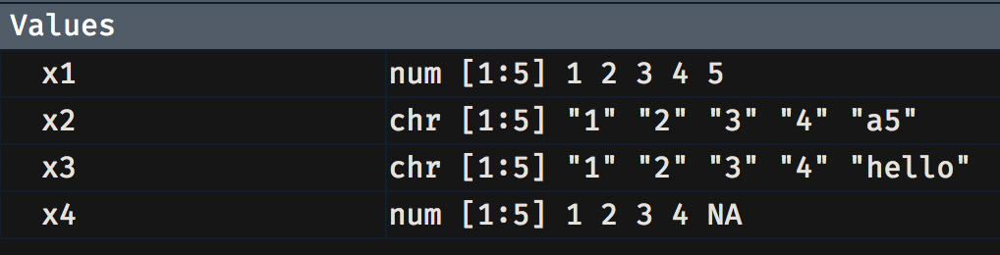
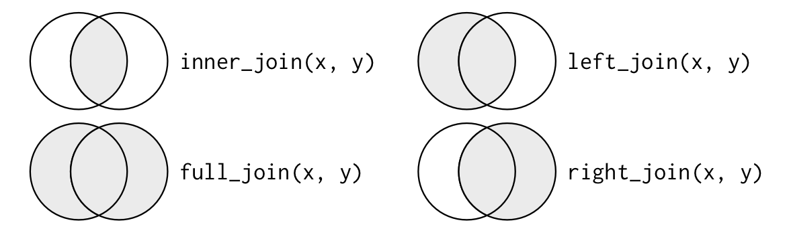

```{r setup, include=FALSE}
options(htmltools.dir.version = FALSE)

knitr::opts_chunk$set(fig.align = 'center', echo = TRUE, warning = FALSE, message = FALSE, dpi = 300, tidy = TRUE, tidy.opts = list(width.cutoff = 90), fig.align = "center", fig.width = 8, fig.height = 6, out.width = "60%", cache = TRUE) 
```

## Agenda 

Basic data operations 
- Common data types 
- Modifying numeric variables 
- Working with factors 
- Subsetting data and factor levels 
- Exporting data 
- Merging data 
- Dealing with duplicates 
- Rearranging a data-frame 

---
class: inverse, center, middle

## Common data types

---

For the most part you'll focus on variables that are 

- numeric -- the usual quantitative measures, also called "continuous" variables 
- factors -- categorical variables such as sex, BMI categories, and so on 
- dates -- but we'll deal with these in detail later 

How R stores numeric variables is more complicated than we need to go into now. For now, we look at `numeric` and `factor` variables in the `hsb` data 

```{r hsb00}
hsb = read.table('https://stats.idre.ucla.edu/stat/data/hsb2.csv', header = TRUE, sep=",")
names(hsb)
str(hsb)
```

---

Some of these variables are not really numeric, in particular: 
- female  = (0/1) 
- race = (1=hispanic 2=asian 3=african-amer 4=white) 
- ses  = socioeconomic status (1=low 2=middle 3=high) 
- schtyp =  type of school (1=public 2=private) 
- prog   = type of program (1=general 2=academic 3=vocational) 

We will have to convert these pseudo-numeric variables and label what the values represent 

```{r df2}
hsb$female = factor(hsb$female, levels = c(0, 1), labels = c("Male", "Female"))
hsb$race = factor(hsb$race, levels = c(1:4), labels = c("Hispanic", "Asian", "African American", "White"))
hsb$ses = factor(hsb$ses, levels = c(1:3), labels = c("Low", "Middle", "High"))
hsb$schtyp = factor(hsb$schtyp, levels = c(1:2), labels = c("Public", "Private"))
hsb$prog = factor(hsb$prog, levels = c(1:3), labels = c("General", "Academic", "Vocational"))
str(hsb)
```

---

If we wanted to be prudent we could have created new factors, preserving the original data (my preference and now a habit) 

```{r df3}
hsb = read.table('https://stats.idre.ucla.edu/stat/data/hsb2.csv', header = TRUE, sep=",")
hsb$female.f = factor(hsb$female, levels = c(0, 1), labels = c("Male", "Female"))
hsb$race.f = factor(hsb$race, levels = c(1:4), labels = c("Hispanic", "Asian", "African American", "White"))
hsb$ses.f = factor(hsb$ses, levels = c(1:3), labels = c("Low", "Middle", "High"))
hsb$schtyp.f = factor(hsb$schtyp, levels = c(1:2), labels = c("Public", "Private"))
hsb$prog.f = factor(hsb$prog, levels = c(1:3), labels = c("General", "Academic", "Vocational"))
```

---

At times, we may have numbers that get read in as characters or factors, as is evident from the example below:

.pull-left[
```{r df4}
x1 = c(1, 2, 3, 4, 5)
x2 = c(1, 2, 3, 4, "a5")
x3 = c(1, 2, 3, 4, "hello")
x4 = c(1, 2, 3, 4, NA)
```
]

.pull-right[
<center></center>
]

Notice that x1 and x2 are read in as numeric but x2 and x3 show up as `chr`, short for `character`. You could convert x2 and x3 into numeric as follows:

```{r df5}
x2.num = as.numeric(x2)
x3.num = as.numeric(x3)
```

The `NA` values are `not applicable` values, essentially `missing values`. 

---

At times the variable may in fact be numeric but because of some anomalies in the variable, R will read it in as a factor. When this happens, converting the variable into numeric has to be done with care. Just running `as.numeric()` will not work. See the example below where `age` is flagged as a factor, perhaps because the variable was stored and exported with the double-quotation marks.  

```{r df6}
score = c(100, 101, 102, 103, 104, 105, 106)
sex = c("Male", "Female", "Male", "Female", "Female", "Male", "Female")
age = c("18", "18", "19", "19", "21", "21", "NA")
my.df = cbind.data.frame(score, sex, age)
```

If I try `as.numeric()` the conversion uses the factor codings 1, 2, 3, 4 instead of the actual age values. So what is recommended is that you run `as.numeric(levels(data$variable))[data$variable]` instead. You can see the difference by comparing `age.num1` against `age.num2`. 

```{r df7}
my.df$age.num1 = as.numeric(my.df$age)
my.df$age.num2 = as.numeric(levels(my.df$age))[my.df$age]
```

Open up the data-frame and then see these two variables to understand how `age.num1` is invalid but `age.num2` is valid 

----

We often need to transform an original numeric variable, stored perhaps as a proportion that we want to convert into a percentage. Or we may want to square it, divide it by 100, and so on. These operations are very straightforward. 

.pull-left[
```{r t0}
my.df = data.frame(x = c(0.1, 0.2, 0.3, 0.4))

# Convert x from proportion to percent
my.df$x.pct = my.df$x * 100

# Divide x by 10
my.df$x.div = my.df$x / 10

# Square x
my.df$x.sqrd = my.df$x^2

# Take the square-root of x
my.df$x.sqrt = sqrt(my.df$x)

# Multiply x by 2
my.df$x.dbled = my.df$x * 2
```
]

.pull-right[
```{r, echo=FALSE}
my.df
```
]
---

We can also group numeric data into `bins`. Let us see this with our  reading scores from the `hsb2` data-set. 

```{r,  echo=FALSE}
load("./data/hsb2.RData")
```

```{r grouping0}
hsb2$grouped_read = cut(hsb2$read, breaks = c(28, 38, 48, 58, 68, 78))
table(hsb2$grouped_read)
```

Uh oh! we have a total of 199 so what happened to the 200th? The one that wasn't grouped is a reading score of 28. Why? You have to choose `left-open` or `right-open` intervals... should 38 go in the 38-48 group or the 28-38 group? This decision can be invoked by adding `right = FALSE` or `right = TRUE` (which is the default). So let me set `right = FALSE`. 

```{r grouping1}
hsb2$grouped_read2 = cut(hsb2$read, breaks = c(28, 38, 48, 58, 68, 78), right = FALSE)
table(hsb2$grouped_read2)
```

Open `hsb2` and arrange rows in ascending order of `read`. Find `read = 48`. With the default `right = TRUE` 48 put in 38-48 group but with `right = FALSE` 48 put in 48-58 group. So `right = FALSE` only include values in a group `(a,b]`  if the value is $a <= x < b$. With `right = TRUE` only include values in a group `[a, b)` if the value is $a < x <= b$. 


---

```{r, echo=FALSE}
library(DT)
datatable(hsb2[, c(7, 12:13)], options = list(columnDefs = list(list(className = 'dt-center', targets = c(1:3))), filter = "top", rownames = FALSE, class = "compact")
          )
```
---

More generally you'll see folks just specify the number of cuts they want. 

```{r grouping2}
hsb2$grouped_read3 = cut(hsb2$read, breaks = 5)
table(hsb2$grouped_read3)
```

But since age cannot include a decimal value this may be unsuitable for our purposes. Of course, we could have avoided this open/closed business of the interval by simply doing this: 

```{r grouping3}
hsb2$grouped_read4 = cut(hsb2$read, breaks = c(25, 35, 45, 55, 65, 75, 85))
table(hsb2$grouped_read4)
```

And there you have it! 

---

class: inverse, center, middle

## Changing case -- lower/upper

---
```{r t1}
my.df = data.frame(sex = c("M", "F", "M", "F"), 
                   NAMES = c("Andy", "Jill", "Jack", "Madison"), 
                   age = c(24, 48, 72, 96))
```

Maybe I want the names of  the individuals to be all uppercase, or perhaps all lowercase. I can do this via: 

```{r t2}
my.df$sex.lower = tolower(my.df$sex)
my.df$sex.upper = toupper(my.df$sex)
```

Maybe it is not the values but the column names that I want to convert to lowercase. This is easily done via 

```{r t3}
colnames(my.df)[2] = "names"
```

Note: I asked for  the second column's name to be changed to "names". I could have achieved the same thing by running:

```{r t4}
my.df = data.frame(sex = c("M", "F", "M", "F"), 
                   NAMES = c("Andy", "Jill", "Jack", "Madison"), 
                   age = c(24, 48, 72, 96))
colnames(my.df) = tolower(colnames(my.df))
```

---

By the same logic, I could convert each column name to uppercase by typing 

```{r t5}
colnames(my.df) = toupper(colnames(my.df))
```

And then of course, using the following to change a specific column name to uppercase: 

```{r t6}
my.df = data.frame(sex = c("M", "F", "M", "F"), 
                   NAMES = c("Andy", "Jill", "Jack", "Madison"), 
                   age = c(24, 48, 72, 96))
colnames(my.df)[1] = toupper(colnames(my.df)[1])
colnames(my.df)[3] = "AGE"
```

What about title case? 

```{r t7}
x = c("somewhere over the rainbow", "to kill a mockingbird", "the reluctant fundamentalist")

library(tools)
x.title = toTitleCase(x)

x.title
```

When we work with `stringi` and `stringr` we'll see other ways of switching letter cases 

---

class: inverse, middle, center

# A little bit about factors 

---

With the `hsb` data we created some factors. Here I want to show you a couple of things to pay attention to. 

First, I can create a new variable and store it as a factor as follows:

```{r f1}
my.df$female1[my.df$SEX == "M"] = 0 
my.df$female1[my.df$SEX == "F"] = 1 
my.df$female1 = factor(my.df$female1, levels = c(0, 1), labels = c("Male", "Female"))
```

I could have also skipped the `0/1` business and just done this: 

```{r f2}
my.df$female2[my.df$SEX == "M"] = "Male" 
my.df$female2[my.df$SEX == "F"] = "Female" 
my.df$female2 = factor(my.df$female2)
```

Notice the difference between `female1` and `female2` 

- female1: Since you specified `levels = c(0, 1)` and indicated the lowest level be mapped to Male, the factor is built in that order ... Male first, then Female 
- female2: Here we did not specify the levels and hence R falls back on its default of building them up alphabetically ... Female first, then Male 

---

Let us see factor levels with a different example. Say we had the following variable, 10 responses to a survey question.

```{r f3}
fdf = data.frame(x = c(rep("Disagree", 3), rep("Neutral", 2), rep("Agree", 5)))
fdf$responses = factor(fdf$x)
levels(fdf$responses)
table(fdf$responses)
```

---

This makes no sense since we'd like the logical ordering of Disagree -> Neutral -> Agree 

```{r f4}
fdf$newresponses = ordered(fdf$responses, levels = c("Disagree", "Neutral", "Agree"))
levels(fdf$newresponses)
min(fdf$newresponses)
table(fdf$newresponses)
```

---

I could have also generated this desired order when creating the factor as, for example, via 

```{r f5}
fdf$xordered = factor(fdf$x, ordered = TRUE, levels = c("Disagree", "Neutral", "Agree"))
levels(fdf$xordered)
min(fdf$xordered)
table(fdf$xordered)
```

Notice the `min()` command ... which asks for the minimum level of a factor. This works with ordered factors but not with unordered factors; try it with `x` and with `responses`. 

---

Before we move on, a word about the command we used to generate a new factor from an existing variable 

```{r f6, eval=FALSE}
my.df$female2[my.df$SEX == "M"] = "Male" 
my.df$female2[my.df$SEX == "F"] = "Female" 
```

I use this a lot when generating new variables, and even when fixing problems with an existing variable. For example, say we were given the data on the sex of these 10 individuals but the values included typos. 

```{r f7}
sexdf = data.frame(mf = c(rep("Male", 3), rep("male", 2), rep("Female", 3), rep("femalE", 2)))
levels(sexdf$mf)
```

Obviously not what we'd like so we can go in and clean it up a bit. How? As follows: 

```{r f8}
sexdf$mf[sexdf$mf == "male"] = "Male" 
sexdf$mf[sexdf$mf == "femalE"] = "Female" 
levels(sexdf$mf)
table(sexdf$mf)
```

---

Wait a second, we still see `femalE` and `male` but with 0 counts; how should we get rid of these ghosts? 

```{r f9}
sexdf$newmf = droplevels(sexdf$mf)
levels(sexdf$newmf)
table(sexdf$newmf)
```

Having fixed this issue we can drop the original variable via 

```{r f10}
sexdf$mf = NULL
```

---

class: inverse, middle, center

# Subsetting data and factor levels 

---

What if want only a susbet of the data? For example, say I am working with the `diamond` data-set and need to subset my analysis to diamonds that are Very Good or better. 

```{r diamondsdata}
library(ggplot2)
data(diamonds)
str(diamonds$cut)
table(diamonds$cut)
```

I can subset as follows: 

```{r dia1}
dia.sub1 = subset(diamonds, cut != "Fair" & cut != "Good")
str(dia.sub1$cut)
table(dia.sub1$cut)
```

---

Aha! I see no diamonds in the excluded cut ratings but `str()` still shows R remembering `cut` as having 5 ratings and the frequency table shows up with zero counts for both so we drop these levels explicitly. 

```{r dia2}
dia.sub1$cutnew = droplevels(dia.sub1$cut)
str(dia.sub1$cutnew)
table(dia.sub1$cutnew)
```

---

Now a bit more on sub-setting data. You can subset with as simple or as complicated a condition you need. For example, maybe you only want Ideal diamonds with a certain minimum clarity and price. 

```{r dia3}
dia.sub2 = subset(diamonds, cut == "Ideal" & clarity == "VVS1" & price > 3933)
table(dia.sub2$cut)
table(dia.sub2$clarity)
min(dia.sub2$price)
```

Here the sub-setting is generating a data-frame that will only include observations that meet all three requirements (since you used `&` in the command). If you had run the following instead you would have had very different results. 

```{r dia4}
dia.sub3 = subset(diamonds, cut == "Ideal" | clarity == "VVS1" | price > 3933)
dia.sub4 = subset(diamonds, cut == "Ideal" & clarity == "VVS1" | price > 3933)
dia.sub5 = subset(diamonds, cut == "Ideal" | clarity == "VVS1" & price > 3933)
```

---

class: inverse, middle, center

# Exporting data

---

Often, after data have been processed in R, we need to share them with folks who don't use R or want the data in a specific format. This is easily done, as shown below. 

```{r dataout}
out.df = data.frame(Person = c("John", "Timothy", "Olivia", "Sebastian", "Serena"), Age = c(22, 24, 18, 24, 35))

write.csv(out.df, file = "./data/out.csv", row.names = FALSE) # CSV format 

library(haven)
write_dta(out.df, "./data/out.df.dta") # Stata format
write_sav(out.df, "./data/out.df.sav") # SPSS format 
write_sas(out.df, "./data/out.df.sas") # SAS format 

library(writexl)
write_xlsx(out.df, "./data/out.df.xlsx") # Excel format
```

There are other packages that import/export data so be sure to check them out as well, in particular [rio](https://cran.r-project.org/web/packages/rio/vignettes/rio.html). 

---

class: inverse, middle, center

# Merging data

---

Say I have data on some students, with test scores in one file and their gender in another file. Each file has a unique student identifier, called `ID`. How can I create a single data-set? Let us see each data-set first.    

```{r merge0}
data1 = data.frame(Score = c(10, 21, 33, 12, 35, 67, 43, 99), ID = c("A12", "A23", "Z14", "WX1", "Y31", "D66", "C31", "Q22"))
data2 = data.frame(Sex = c("Male", "Female", "Male", "Female", "Male", "Female", "Male", "Female"), ID = c("A12", "A23", "Z14", "WX1", "Y31", "D66", "E52", "H71"))
```

Open both data-sets and note C31 and Q22 missing from `data2` &  E52 and H71 missing from `data1`.  

.pull-left[
```{r mergedt1, echo=FALSE}
datatable(data1, options = list(columnDefs = list(list(className = 'dt-center', targets = c(1:2))), filter = "top", rownames = FALSE, class = "compact"))
```
]

.pull-right[
```{r mergedt2, echo=FALSE}
datatable(data2, options = list(columnDefs = list(list(className = 'dt-center', targets = c(1:2))), filter = "top", rownames = FALSE, class = "compact"))
```
]
---

What about the merge? To merge data-frames we need to specify the `merge key(s)`  -- the variable(s) that identifies unique observations in each file. This variable(s) must be present in all the files you want to merge. So long as it exists, you now need to decide: Do you only want to 

- merge observations that show up in both files `(natural join)` 
- merge everything even if some cases show up in one but not the other `(full outer join)` 
- merge such that all cases in file `x` are retained but only those seen in file `y` are joined `(left outer join)` 
- merge to keep all cases in `y` and only those cases are to be merged from `x` that show up in `y`, referred to as `(right outer join)` 

```{r merge1}
natural = merge(x = data1, y = data2, by = c("ID"), all = FALSE) # only merge if ID seen in both files
full = merge(x = data1, y = data2, by = c("ID"), all = TRUE) # merge everything 
left = merge(x = data1, y = data2, by = c("ID"), all.x = TRUE) # make sure all cases from file x are retained 
right = merge(x = data1, y = data2, by = c("ID"), all.y  = TRUE)  # make sure all cases from file y are retained 
```

[Garrett and Hadley](http://r4ds.had.co.nz) have a wonderful chapter on joins and the diagram below is one of their many descriptors. 

<center></center>
---

What if the ID variables had different names in the files? You could rename them to have a common name or you could use `by.x =` and `by.y = ` as shown below. 

```{r merge2}
data3 = data.frame(Score = c(10, 21, 33, 12, 35, 67, 43, 99), ID1 = c("A12", "A23", "Z14", "WX1", "Y31", "D66", "C31", "Q22"))
data4 = data.frame(Sex = c("Male", "Female", "Male", "Female", "Male", "Female", "Male", "Female"), ID2 = c("A12", "A23", "Z14", "WX1", "Y31", "D66", "E52", "H71"))
diffids = merge(data3, data4, by.x = c("ID1"), by.y = c("ID2"), all = FALSE)
```

You can also have more than one merge key. For example, if I am merging data for Ohio schools, each district has a district ID number `(dirn)`, each school has building ID number `(birn)`, and then the district's name `(district)`, the building's name `(building)`, and so on. If I am merging these data then my `by = ` statement will be `by = c("dirn", "birn", "district", "building")`.  

---

If we have multiple data-frames to merge we can do so in several ways but my default approach is to rely on the `Reduce()` command, as shown below. 

```{r merge3}
df1 = data.frame(Score = c(10, 21, 33, 12, 35, 67, 43, 99), ID = c("A12", "A23", "Z14", "WX1", "Y31", "D66", "C31", "Q22"))
df2 = data.frame(Sex = c("Male", "Female", "Male", "Female", "Male", "Female", "Male", "Female"), ID = c("A12", "A23", "Z14", "WX1", "Y31", "D66", "E52", "H71"))
df3 = data.frame(Age = c(6, 7, 6, 8, 8, 9, 10, 5), ID = c("A12", "A23", "Z14", "WX1", "Y31", "D66", "E52", "H71"))

my.list = list(df1, df2, df3)
df.123 = Reduce(function(...) merge(..., by = c("ID"), all = TRUE), my.list)
```

---

class: inverse, middle, center

# Dealing with duplicates 

---

Every now and then you also run into duplicate rows with no good explanation for how that could have happened. Here is an example: 

```{r dups0}
dups.df = data.frame(Sex = c("Male", "Female", "Male", "Female", "Male", "Female", "Male", "Female"), ID = c("A12", "A23", "Z14", "WX1", "Y31", "D66", "A12", "WX1"))
```

Students A12 and WX1 show up twice! There are two basic commands that we can use to find duplicates -- `unique` and `duplicated`. 

```{r dups1, eval=FALSE}
duplicated(dups.df) # flag duplicate rows with TRUE 

!duplicated(dups.df) # flag not duplicated rows with TRUE 

dups.df[duplicated(dups.df), ] # reveal the duplicated rows 

dups.df[!duplicated(dups.df), ] # reveal the not duplicated rows 

nodups.df = dups.df[!duplicated(dups.df), ] # save a dataframe without duplicated rows

onlydups.df = dups.df[duplicated(dups.df), ] # save a dataframe with ONLY the duplicated rows
```

---

class: inverse, middle, center

# Rearranging the data-set

---

We may, at times, want to move the variables around so they are in a particular order (age next to race and so on, for example), perhaps drop some because there are too many variables and we don't need all of them. We may also want to arrange the data-frame in ascending or descending order of some variable(s) (increasing order of age or price for example. 

```{r arrange0}
df1 = mtcars[order(mtcars$mpg), ] # arrange the data-frame in ascending order of mpg 
df2 = mtcars[order(-mtcars$mpg), ] # arrange the data-frame in descending order of mpg 
df3 = mtcars[order(mtcars$am, mtcars$mpg), ] # arrange the data-frame in ascending order of automatic/manual and then in ascending order of mpg 
```

What if I want to order the columns such that the first column is `am` and then comes `mpg`, followed by `qsec` and then the rest of the columns? Well, the first thing I want to do is see what variable is in which column via the `names()` command. 

```{r arrange1}
names(mtcars) # the original structure of the mtcars data-frame
```

So `mpg` is in column 1, `cyl` is in column 2, and `carb` is the last one in column 11. 

Now I'll specify that I want all rows by doing this `[, c()]` and then specify the order of the columns by entering the column numbers in `c()`

```{r arrange2}
df4 = mtcars[, c(9, 1, 7, 2:6, 8, 10:11)] # specifying the position of the columns 
names(df4)
```

---

If I only wanted certain columns I could simply not list the other columns. 

```{r arrange3}
df5 = mtcars[, c(9, 1, 7)] # specifying the position of the columns 
```

Remember the comma in `mtcars[,` ... this tells R to keep all rows in mtcars. If, instead, I did this I would only get the first four rows, not all.  

```{r arrange4}
df6 = mtcars[1:4, c(9, 1, 7)] # keep first four rows and the specified columns
```

I would end up with only the first four rows of mtcars, not every row. So try to remember the order: `dataframe[i, j]` where `i` reference the rows and `j` reference the columns. 

---
class: inverse, middle, center 

# Working with strings 

---

Often you run into strings that have to be manipulated. Often, when working with county data, for example, county names are followed by ` County, Ohio` and this is superfluous so we end up excising it 

```{r}
c.data = read.csv("./data/strings.csv")
head(c.data)
```

Let us just retain the county name from `GEO.display.label` 

```{r}
c.data$county = gsub(" County, Ohio", "", c.data$GEO.display.label)
head(c.data)
```

Note the sequence `gsub("look for this pattern", "replace with this", mydata$myvariable)`

---
#### `with` and `within`

If you need to add variables to an existing data frame, you can do it in several ways: 

```{r}
dfw = data.frame(x = seq(0, 5, by = 1), y = seq(10, 15, by = 1))
dfw$xy1 = dfw$x * dfw$y  # the most basic creation of xy 
dfw$xy2 = with(dfw, x * y)  # using with
dfw = within(dfw, xy3 <- x * y)  # using within
```

```{r within}
knitr::kable(dfw, booktabs = TRUE, "html") %>% kableExtra::kable_styling(full_width = F)
```

Notice that if using `within()` the variable name must be specified as in `xy3 <- x * y` 

---
#### ifelse and grepl

The `ifelse` command is a useful one when creating new variables (invariable factors) from an existing variable 

The long way ...

```{r}
data(mtcars)
mtcars$automatic2[mtcars$am == 1] = "Automatic"
mtcars$automatic2[mtcars$am == 0] = "Manual"
```
The more efficient way ... 

```{r}
mtcars$automatic = ifelse(mtcars$am == 1, "Automatic", "Manual")
```

If you have strings, then `grepl` comes into play: 

```{r}
load("./data/movies.RData")
movies$comedy = ifelse(grepl("Comedy", movies$genres), "Yes", "No")
movies$in1995 = ifelse(grepl("(1995)", movies$title), "Yes", "No")
movies$night = ifelse(grepl("Night", movies$title), "Yes", "No")
```

In short, the function looks for the specified string (“Comedy”) in genres and if found adds a flag of “Yes” and if not found adds a flag of “No”

---
But what if I wanted to run more complicated expressions, for example if the words “Night” or “Dark” or “Cool” are used in the title?

```{r}
movies$tricky = ifelse(grepl("Night", movies$title), "Yes", 
                       ifelse(grepl("Dark", movies$title), "Yes", 
                              ifelse(grepl("Cool", movies$title), "Yes", "No"))
                       )
```

Ah `grepl`, you beauty!! Nesting our way to what we want ...

`grep()` and `grepl()` differ in that both functions find patterns but return different output types 
- `grep()` returns numeric values that index the locations where the patterns were found 
- `grepl()` returns a logical vector in which TRUE represents a pattern match and FALSE does not

Run the two commands that follow and focus on the output that scrolls in the console

```{r, eval=FALSE}
grep("Comedy", movies$genres)
grepl("Comedy", movies$genres)
```

---
You could use both for sub-setting data as well. 

```{r, eval=FALSE}
mov1 = movies[grep("Comedy", movies$genres), ]
mov2 = movies[-grep("Comedy", movies$genres), ]
```
Say I only want columns that have the letter “t” in them. No problem:

```{r, eval=FALSE}
mov3 = movies[, grep("t", colnames(movies))]  # keep if t is in column name 
mov4 = movies[, -grep("t", colnames(movies))]  # keep if t is not in column name 
```

Try using `grepl` instead of `grep` with the preceding two commands and see what results ...

```{r, eval = FALSE}
mov3 = movies[, grepl("t", colnames(movies))]
mov4 = movies[, -grepl("t", colnames(movies))] 
```
---
class: inverse, middle, center

# sums and means 

---
```{r}
dfs = data.frame(x = c(0, 1, 2, 3, 4, NA), y = c(10, 11, 12, NA, 14, 15))
dfs
```

`rowSums()` for each row, sum the columns so that you end up with a row total 
```{r}
rowSums(dfs, na.rm = TRUE)  # sum columns 1 and 2 for each row 
```

`colSums()` for each column, calculate the sum of its values 
```{r}
colSums(dfs, na.rm = TRUE)
```

---

`rowMeans()` for each row, calculate the mean of the columns 
````{r}
rowMeans(dfs, na.rm = TRUE)
```
`colMeans()` for each column, calculate the mean 
````{r}
colMeans(dfs, na.rm = TRUE)
```


