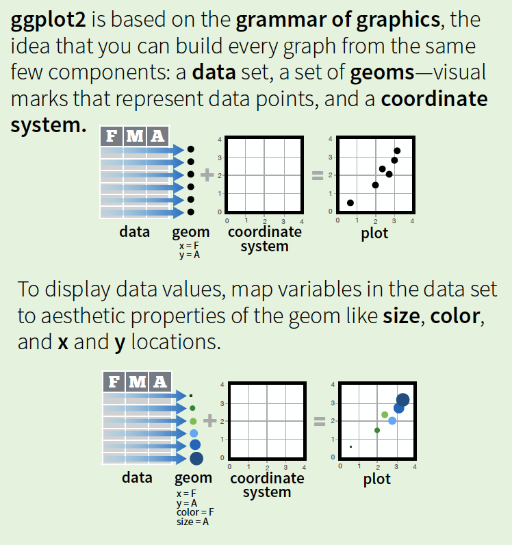
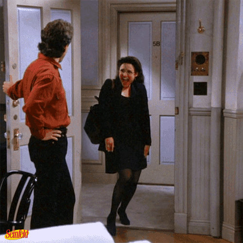

```{r, eval = FALSE, echo = FALSE}
# layout: true
  
# <div class="my-header"></div>
# <div class="my-footer"><span>xaringan power    
# &emsp;&emsp;&emsp;&emsp;&emsp;&emsp;&emsp;&emsp;&emsp;&emsp;&emsp;&emsp;&emsp;
# &emsp;&emsp;&emsp;&emsp;&emsp;&emsp;&emsp;&emsp;&emsp;&emsp;&emsp;&emsp;&emsp;
# yolo</span></div> 
# 


# xaringan::inf_mr('/Users/ruhil/Documents/Teaching/Data Analytics/presentations/Module02.Rmd') 
# xaringan::inf_mr('./presentations/Module02.Rmd')
```


```{r setup, include=FALSE}
options(htmltools.dir.version = FALSE)

knitr::opts_chunk$set(fig.align = 'center', echo = TRUE, warning = FALSE, message = FALSE, dpi = 300, cache = TRUE, tidy = TRUE, tidy.opts = list(width.cutoff = 65), fig.align = "center", fig.width = 8, fig.height = 6, outwidth = "60%") 
```

## Agenda 

Visualizing data 
- graphics with `ggplot2` 
- maps with `leaflet` 

---
class: inverse, center, middle

# Visualizing data

---

## graphics in R  

Three common ways to generate graphics in R are via 
- `base R` 
- `lattice` 
- `ggplot2` 

We will skip `base R` graphics since `ggplot2` will be the graphics package for this class. 
Let us see how we use it, starting with a simple bar-chart

Remember the basic options... 
- one qualitative/categorical variables: `bar-chart` 
- one quantitative/continuous variables: `histogram/box-plot/area-chart`  
- two quantitative/continuous variables: `scatter-plot/hex-bin` 

---

I will use two data-sets, the first being this [IMDB data-set](http://imdb.com/: 

> The internet movie database, http://imdb.com/, is a website devoted to collecting movie data supplied by studios and fans. It claims to be the biggest movie database on the web and is run by amazon. More about information imdb.com can be found online, http://imdb.com/help/show_ leaf?about, including information about the data collection process, http://imdb.com/help/show_leaf?infosource.

```{r}
library(ggplot2movies)
```

A data frame with 28819 rows and 24 variables 

- title. Title of the movie. 
- year. Year of release. 
- budget. Total budget (if known) in US dollars 
- length. Length in minutes. 
- rating. Average IMDB user rating. 
- votes. Number of IMDB users who rated this movie. 
- r1-10. Multiplying by ten gives percentile (to nearest 10%) of users who rated this movie a 1. 
- mpaa. MPAA rating (missing for a lot of movies) 
- action, animation, comedy, drama, documentary, romance, short. Binary variables representing if movie was classified as belonging to that genre. 

---

The second data-set is the [Star Wars dataset](https://swapi.co), a `tibble` with 87 rows and 13 variables:

```{r}
library(dplyr)
data(starwars)
```

- name: Name of the character 
- height: Height (cm)
- mass: Weight (kg)
- hair_color,skin_color,eye_color: Hair, skin, and eye colors
- birth_year: Year born (BBY = Before Battle of Yavin)
- gender: male, female, hermaphrodite, or none.
- homeworld: Name of homeworld
- species: Name of species
- films: List of films the character appeared in
- vehicles: List of vehicles the character has piloted
- starships: List of starships the character has piloted

a `tibble` you say? 

---
## dataframes vs. tibbles
.pull-left[ 
R's default is to store a `dataframe`, as shown below with a small example and there is a tendency to convert characters into factors, change column names, etc. 

```{r df, tidy.opts = list(width.cutoff = 50)}
adf = data.frame(`Some Letters` = c("A", "B", "C"), 
                 `Some Numbers` = c(1, 2, 3))
str(adf)
print(adf)
```
]

.pull-right[

`tibbles` is the brainchild of the team behind a bundle of packages (and RStudio) called the `tidyverse` that drop R's bad habits 

```{r tib, tidy.opts = list(width.cutoff = 45)}
atib = tibble(`Some Letters` = c("A", "B", "C"), 
              `Some Numbers` = c(1, 2, 3))
glimpse(atib)
print(atib)
```
]

There are other advantages to tibbles that we will encounter at a later stage

---
class: inverse, center, middle 


---
#### `ggplot2` and the [grammar of graphics](http://vita.had.co.nz/papers/layered-grammar.html)

<center></center>

---

`qplot` will generate a quick plot but `ggplot2` is the way to go so we build with it

```{r, out.width="10%"}
library(ggplot2)
ggplot(data = starwars)
```

Nothing results since we have not specified how we want the variable(s) to be `mapped` to the coordinate system... what variable should go on what axis? 

```{r, out.width="10%"}
ggplot(data = starwars, mapping = aes(x = eye_color)) 
```

Now we are getting somewhere. We see the canvas with the specific eye colors on the x-axis but nothing else has been drawn since we have not specified the `geometry` ... do you want a bar-chart? histogram? dot-plot? line-chart? what?? 

???
- point out that they should have read the material on the `grammar of graphics` ... not essential to understand `ggplot2` but helpful if they want to specialize in visualizations 

---
With a categorical variable the bar-chart would be appropriate and so we ask for a `geom_bar()` 

```{r, out.width="40%"}
ggplot(data = starwars, mapping = aes(x = eye_color)) + geom_bar()
```

Other `aesthetics` can be added, such as `group`, `color`, `fill`, `size`, `alpha` , axis labels, plot title/subtitle etc

Two commands for adding a color scheme -- `color` or `colour` versus `fill`
---
```{r col1, out.width="40%"}
ggplot(data = starwars, mapping = aes(x = eye_color, colour = eye_color)) + geom_bar() + labs(x = "Eye Color", y = "Frequency", title = "Bar-chart of Eye Color", subtitle = "(of Star Wars characters)")
```

Note what `colour = ` generated for us 

---

```{r col2, out.width="40%"}
ggplot(data = starwars, mapping = aes(x = eye_color, fill = eye_color)) + geom_bar() + labs(x = "Eye Color", y = "Frequency", title = "Bar-chart of Eye Color", subtitle = "(of Star Wars characters)")
```

Note what `fill = ` generated for us 

Of course, it would be good to have the colors match the eye-color so let us do that next 

???
- Point out how important it is to label x-axis, y-axis, add a title 
- Remind them about setting y limit to start at 0 or then making a note in the plot for readers so they don't assume it is at 0 when in fact it has been truncated for ease of data presentation. If this misstates the pattern in the data, they should not do it or again, annotate the plot to that effect so nobody is misled 

---

```{r, out.width="50%"}
mycolors = c("black", "blue", "slategray", "brown", "gray34", "gold", "greenyellow", "navajowhite1", "orange", "pink", "red", "magenta", "thistle3", "white", "yellow")
ggplot(data = starwars, mapping = aes(x = eye_color)) + geom_bar(fill = mycolors) + labs(x = "Eye Color", y = "Frequency", title = "Bar-chart of Eye Color", subtitle = "(of Star Wars characters)")
```

R Colors used from [this source](http://www.stat.columbia.edu/~tzheng/files/Rcolor.pdf) but see also [this source](https://www.nceas.ucsb.edu/~frazier/RSpatialGuides/colorPaletteCheatsheet.pdf)  

???
- Colors can be customized by generating your own palettes
- [Color Brewer is here](http://colorbrewer2.org/#type=sequential&scheme=YlGnBu&n=3)
- Remind them to read the materials on choosing colors wisely, particularly the point about qualitative palettes, divergent palettes, and then palettes that work well even with colorblind audiences 

---

I'll switch to a different variable and show you how to use prebuilt color palettes 

.pull-left[
```{r, out.width="60%", tidy.opts = list(width.cutoff = 45)}
ggplot(data = starwars, mapping = aes(x = gender)) + geom_bar(aes(fill = gender)) + labs(x = "Gender", y = "Frequency", title = "Bar-chart of Gender", subttitle = "(of Star Wars characters)", caption = "(Source: The dplyr package)") + scale_fill_brewer(palette = "Pastel1")
```
]

.pull-right[
```{r, out.width="60%", tidy.opts = list(width.cutoff = 45)}
library(wesanderson)
ggplot(data = starwars, mapping = aes(x = gender)) + geom_bar(aes(fill = gender)) + labs(x = "Gender", y = "Frequency", title = "Bar-chart of Gender", subtitle = "(of Star Wars characters)", caption = "(Source: The dplyr package)") + scale_fill_manual(values = wes_palette("Darjeeling1"))
```
]

Study the commands carefully 

- `scale_fill_brewer` is being used in the plot on the left, calling on built-in color palettes. You can [review them here](http://ggplot2.tidyverse.org/reference/scale_brewer.html) 
- `scale_fill_manual` is being used in the plot on the right and a specific palette is being invoked from [the wesanderson package](https://github.com/karthik/wesanderson) 
- Color palettes will come into play far more later on in this course 

???

- Using the wes anderson palette 
- Adding the `caption = ` command to source the data 
- Switching from `scale_fill_brewer()` to `scale_fill_manual()` 

---
One can also lean on various plotting themes as shown below 

```{r, out.width = "35%"}
library(ggthemes)
p1 = ggplot(data = starwars, mapping = aes(x = eye_color)) + geom_bar() +  theme_tufte() + theme(axis.text.x = element_text(size = 6)) 
p2 = ggplot(data = starwars, mapping = aes(x = eye_color)) + geom_bar() + theme_solarized() + theme(axis.text.x = element_text(size = 6)) 
p3 = ggplot(data = starwars, mapping = aes(x = eye_color)) + geom_bar() + theme_economist() + theme(axis.text.x = element_text(size = 6)) 
p4 = ggplot(data = starwars, mapping = aes(x = eye_color)) + geom_bar() +  theme_fivethirtyeight() + theme(axis.text.x = element_text(size = 6)) 
library(patchwork)
p1 + p2 + p3 + p4 + plot_layout(ncol = 2)
```

Later on you will learn these & other ways to build advanced visualizations ...for now we get to work more with `ggplot2`  

---

class: inverse, center, middle

## more with bar-charts 

---

.pull-left[
```{r bar01, out.width = "70%", dev = "svg"}
library(ggplot2)
ggplot(data = movies, aes(x = mpaa)) + geom_bar() + theme_minimal()
```
]

.pull-right[
```{r bar02, out.width = "70%", dev = "svg"}
library(ggplot2)
ggplot(data = movies) + geom_bar(aes(x = mpaa)) + theme_minimal()
```
]

Notice how the `aes(x = mpaa)` is placed differently in the two commands and yet yields identical plots 

---
MPAA ratings are missing for a lot of movies so we eliminate these from the plot via `subset(mpa != "")`  

```{r bar2, out.width = "40%", dev = "svg"}
str(movies$mpaa)
ggplot(subset(movies, mpaa != ""), aes(x = mpaa)) + geom_bar() + theme_minimal()
```

The order of the bars is fortuitous in that it goes from the smallest frequency to the highest frequency. 

---
I said fortuitous because the default is to order the bars in an ascending alphabetic/alphanumeric order if the variable is a **character**. See below for an example. 

```{r gg1, out.width = "40%", dev = "svg"}
df = tibble(x = c(rep("A", 2), rep("B", 4), rep("C", 1)))
ggplot(data = df, aes(x = x)) + geom_bar() + theme_minimal()
```

Later on we'll learn how to order the bars with ascending/descending frequencies or by some other logic 

---

What about plotting the `relative frequencies` on the y-axis rather than the frequencies? 

```{r, out.width = "40%", dev = "svg"}
ggplot(data = subset(movies, mpaa != ""), aes(x = mpaa, y = (..count..)/sum(..count..))) + geom_bar() + scale_y_continuous(labels = scales::percent) + xlab("MPAA Rating") + ylab("Relative Frequency (%)") + theme_minimal() 
```

Note the addition of 
- `y = (..count..)/sum(..count..)` 
- `scale_y_continuous(labels = scales::percent)` 

---

We could also add a second or even a third/fourth categorical variable. Let us see this with our `hsb2` data-set 

```{r, out.width="40%", dev = "svg"}
load("data/hsb2.RData")
ggplot(data = hsb2, aes(x = ses, group = female)) + geom_bar(aes(fill = female)) + theme_minimal()
```

This is not very useful since the viewer has to estimate the relative sizes of the two colors within any given bar. 

---

```{r, out.width="40%", dev = "svg"}
ggplot(data = hsb2, aes(x = ses, group = female)) + geom_bar(aes(fill = female), position = "dodge") + theme_minimal()
```

`position = "dodge"` will juxtapose the bars, and this is much better. 

---

This is fine if you want to know what percent of the 200 students are low SES males, low SES females, etc. What if you wanted to calculate percentages within each sex? 

```{r, out.width="40%", dev = "svg"}
ggplot(data = hsb2, aes(x = ses, y = female)) + geom_bar(aes(group = female, fill = female, y = ..prop..), position = "dodge") + scale_y_continuous(labels = scales::percent) + ylab("Relative Frequency (%)") + xlab("Socioeconomic Status Groups") + theme_minimal()
```

---

What about within each ses? 

```{r, out.width="40%", dev = "svg"}
ggplot(data = hsb2, aes(x = female, y = ses)) + geom_bar(aes(group = ses, fill = ses, y = ..prop..), position = "dodge") + scale_y_continuous(labels = scales::percent) + ylab("Relative Frequency (%)") + xlab("Socioeconomic Status Groups") + theme_minimal()
```

---

class: inverse, center, middle

## histograms  

???
- They can [visit](http://tinlizzie.org/histograms/) to remind themselves of all the various pieces that build up a histogram and the meaning/value behind each component 
- They should look at [Yau's piece here](https://flowingdata.com/2014/02/27/how-to-read-histograms-and-use-them-in-r/) and [here](https://flowingdata.com/2017/06/07/how-histograms-work/)

---

`geom_histogram()` does the trick but note that the default number of bins is not very useful and can be tweaked, along with other embellishments 

```{r gg2a, out.width = "40%", dev = "svg"}
ggplot(data = hsb2, aes(x=read)) + geom_histogram(fill="cornflowerblue", color = "white") + ggtitle("Histogram of Reading Scores") + xlab("Reading Score") + ylab("Frequency") + theme_minimal()
```

---

See `bins = 5` and also experiment with `binwidth = `

```{r gg2b, out.width = "40%", dev = "svg"}
ggplot(data = hsb2, aes(x=read)) + geom_histogram(fill="cornflowerblue", color = "white", bins = 5) + ggtitle("Histogram of Reading Scores") + xlab("Reading Score") + ylab("Frequency") + theme_minimal()
```

---
  
If we wanted to break out the histogram by one or more categorical variables, we could do so

```{r gg3, out.width = "40%", dev = "svg"}
ggplot(hsb2, aes(x = read)) + geom_histogram(fill="cornflowerblue", bins = 5, color = "white") + ggtitle("Histogram of Reading Scores") + xlab("Reading Score") + ylab("Frequency") + facet_wrap(~ female) + theme_minimal()
```

---

Or better yet, 

```{r gg4, out.width = "40%", dev = "svg"}
ggplot(hsb2, aes(x = read)) + geom_histogram(fill="cornflowerblue", bins = 10, color = "white") + ggtitle("Histogram of Reading Scores") + xlab("Reading Score") + ylab("Frequency") + facet_wrap(~ female, ncol = 1) + theme_minimal()
```

since now the distributions are stacked above each, easing comparisons 

---

One useful design element with breakouts is placing in relief the consolidated data (i.e., the distribution without break-outs) 

```{r gg4context, out.width = "40%", dev = "svg", echo=FALSE}
ggplot(data = hsb2, aes(x = read, fill = female)) + geom_histogram(bins = 10, color = "white") + ggtitle("Histogram of Reading Scores") + xlab("Reading Score") + ylab("Frequency") + facet_wrap(~ female, ncol = 1) + geom_histogram(data = hsb2[, -2], bins = 10, fill = "grey", alpha = .5) + theme_minimal()
```

Here it is obvious that the distribution of readings scores of any one sex are similar to the overall distribution so perhaps the groups are not really that different in terms of reading scores 

---
For breakouts with two categorical variables we could do 

```{r gg5a, out.width = "40%", dev = "svg"}
ggplot(data = hsb2, aes(x = read)) + geom_histogram(fill="cornflowerblue", bins = 10, color = "white") + ggtitle("Histogramx of Reading Scores") + xlab("Reading Score") + ylab("Frequency") + facet_wrap(~ female + schtyp, ncol = 2) + theme_minimal()
```

Note that `~ female + schtyp` renders the panels for the first category of female by all categories of schtyp and then repeats for the other category of female 

---

```{r gg5b, out.width = "40%", dev = "svg"}
ggplot(data = hsb2, aes(x = read)) + geom_histogram(fill="cornflowerblue", bins = 10, color = "white") + ggtitle("Histogramx of Reading Scores") + xlab("Reading Score") + ylab("Frequency") + facet_wrap(schtyp ~ female, ncol = 2) + theme_minimal()
```

Note that `schtyp ~ female` renders the panels for the first category of schtype for all categories of female and then repeats for the other category of schtyp 


---

... which is the same as ...

```{r gg5c, out.width = "40%", dev = "svg"}
ggplot(data = hsb2, aes(x = read)) + geom_histogram(fill="cornflowerblue", bins = 10, color = "white") + ggtitle("Histogramx of Reading Scores") + xlab("Reading Score") + ylab("Frequency") + facet_wrap(~ schtyp + female, ncol = 2) + theme_minimal()
```

---
class: inverse, middle, center

## Ridge-plots 

---

These were all the rage in the summer of 2017, and named `joy plots` but the unfortunate connection with the source of the plots led the name to be revised to `ridge-plots`. If you are curious, see [why not joy?](http://serialmentor.com/blog/2017/9/15/goodbye-joyplots). You need to have installed the `ggridges` package but other than that, they are easy to craft. 

```{r ridge1, out.width = "40%", dev = "svg"}
library(viridis)
library(ggridges)
library(ggthemes)
ggplot(lincoln_weather, aes(x = `Mean Temperature [F]`, y = `Month`)) + geom_density_ridges(scale = 3, alpha = 0.3, aes(fill = Month)) + labs(title = 'Temperatures in Lincoln NE', subtitle = 'Mean temperatures (Fahrenheit) by month for 2016\nData: Original CSV from the Weather Underground') + theme_ridges() + 
theme(axis.title.y = element_blank(), legend.position = "none")  
```

---

Here is another one, mapping the distribution of hemoglobin in four populations (the US being the reference group) as part of a study looking at the impacy of altitude on hemoglobin concentration (courtesy Whitlock and Schluter). 

```{r ridge2, out.width = "40%", dev = "svg"}
hemoglobinData <- read.csv(url("http://whitlockschluter.zoology.ubc.ca/wp-content/data/chapter02/chap02e3cHumanHemoglobinElevation.csv"))

ggplot(hemoglobinData, aes(x = hemoglobin, y = population)) + geom_density_ridges(scale = 3, alpha = 0.3, aes(fill = population)) + labs(title = 'Hemoglobin Concentration Levels', subtitle = 'in Four populations') + theme_ridges() + theme(axis.title.y = element_blank(), legend.position = "none")  
```

As should be evident, they are visually appealing when comparing a large number of groups on a single continuous variable and using simple `facet-wrap` or other options would be infeasible. 

---

class: inverse, middle, center

## Box-plots

---

These can be useful to look at the distribution of a continuous variable 

```{r box1, out.width = "40%", dev = "svg"}
ggplot(hemoglobinData, aes(y = hemoglobin, x = "")) + geom_boxplot(fill = "cornflowerblue") + coord_flip() + xlab("") + ylab("Hemoglobin Concentration")  + theme_minimal()
```

Note 
- the `x = ""` in `aes()` because otherwise with a single group the box-plot will not build up 
- `coord_flip()` is flipping the x-axis and y-axis 

---

```{r box2, out.width = "40%", dev = "svg"}
ggplot(hemoglobinData, aes(y = hemoglobin, x = population, fill = population)) + geom_boxplot() + coord_flip() + xlab("") + ylab("Hemoglobin Concentration") + theme(axis.title.y = element_blank(), legend.position = "none") + theme_minimal()
```
Notice the need for no legend with `fill = population` 

---
class: inverse, center

## line charts 

---

ideal use: time series data 

```{r line1, out.width = "40%", dev = "svg"}
library(plotly)
data(economics)
# names(economics)
ggplot(economics, aes(x = date, y = uempmed)) + geom_line() + xlab("Date") + ylab("Unemployment Rate")   + theme_minimal()
```

---

```{r line2, out.width = "40%", dev = "svg"}
load("./data/gap.df.RData")
ggplot(gap.df, aes(x = year, y = LifeExp, group = continent, color = continent)) + geom_line() + geom_point() + xlab("Year") + ylab("Median Life Expectancy (in years)") + theme(legend.position = "bottom")  + theme_minimal()
```

Pretty ugly!!

---
but we can dress these up by using `plotly` 

```{r line3, out.width = "40%", dev = "svg"}
library(plotly)
myplot = plot_ly(economics, x = ~date) %>% add_trace(y = ~uempmed, line = list(color = 'black'), mode = "lines", name = "Unemployment Rate") %>% add_trace(y = ~psavert, line = list(color = 'red'), mode = "lines", name = "Personal Savings Rate") %>% layout(autosize = F, width = 600, height = 300)

library(shiny)
div(myplot, align = "center")
```

---
class: .inverse, middle

## Two quantitative variables 

---

scatter-plots ...

```{r sc1, out.width = "40%", dev = "svg"}
load("./data/hsb2.RData")
ggplot(hsb2, aes(x = write, y = science)) + geom_point() + xlab("Writing Scores") + ylab("Science Scores")  + theme_minimal()
```

---

highlight `ses`

```{r sc2, out.width = "40%", dev = "svg"}
ggplot(hsb2, aes(x = write, y = science)) + geom_point(aes(color = ses)) + xlab("Writing Scores") + ylab("Science Scores") + theme(legend.position = "bottom")  + theme_minimal()
```


---

breakout ses for ease of interpretation 

```{r sc3, out.width = "40%", dev = "svg"}
ggplot(hsb2, aes(x = write, y = science)) + geom_point() + xlab("Writing Scores") + ylab("Science Scores") + facet_wrap(~ ses)  + theme_minimal()
```

---

make it interactive with `plotly`

```{r sc4, out.width = "40%", dev = "svg"}
p = plot_ly(hsb2, x = ~write, y = ~science, color = ~ses) %>% layout(autosize = FALSE, width = 600, height = 300) 
div(p, align = "center")
```

---
`count plots`: see the frequency of given pairs of values by varying sizes of the points. The more the frequency of a pair the greater the size of these points. 

```{r count1, out.width = "40%", dev = "svg"}
data(mpg, package="ggplot2")
ggplot(mpg, aes(x = cty, y = hwy)) + geom_count(col = "firebrick", show.legend = FALSE) +
  labs(subtitle = "City vs Highway mileage", y="Highway mileage", x = "City mileage")  + theme_minimal()
```

---

our `Boston Marathon` data

```{r count2, out.width = "40%", dev = "svg"}
boston = read.csv("./data/BostonMarathon.csv")
boston2 = boston[sample(nrow(boston), 200), ]

ggplot(boston2, aes(x = Age, y = finishtime, group = M.F)) + geom_count(aes(color = M.F), show.legend = FALSE) + labs(subtitle = "", y = "Finishing Times (in seconds)", x = "Age (in years)") + facet_wrap(~ M.F, ncol = 1) + theme_minimal()
```


---
class: inverse, middle

## hexbins

---

- scatter-plots not helpful when data points overlap 
- hex-bins carve up the plotting grid into hexagons of equal size, count how many $x,y$ pairs fall in each hexagon, and use a color scheme (like a heatmap) to show where hexagons have more data versus less. 

```{r hex1, out.width = "40%", dev = "svg"}
ggplot(data = diamonds, aes(y = price, x = carat)) + geom_hex() + xlab("Weight in Carats") + ylab("Price")  + theme_minimal()
```

---

- adding a third variable 

```{r hex2, out.width = "40%", dev = "svg"}
ggplot(data = diamonds, aes(y = price, x = carat)) + geom_hex() + xlab("Weight in Carats") + ylab("Price") + facet_wrap(~ color)  + theme_minimal()
```

---
class: inverse, center, middle

# Mapping in R

- leaflet demo 



---

`leaflet` is an easy to learn JavaScript library that generates interactive maps 

```{r leaf1}
library(leaflet)
library(leaflet.extras)
library(widgetframe)

m1 <- leaflet() %>% setView(lat = 39.322577, lng = -82.106336, zoom = 14) %>% 
  addTiles() %>% setMapWidgetStyle() %>%
  frameWidget(height = '275')
saveWidget(m1, 'leaflet.html')
m1
```

- `setView()` centers the map with given lat/lng 
- `zoom =` applies zoom factor 

---

drop a pin on Building 21 

```{r leaf2}
m2 <- leaflet() %>% setView(lat = 39.322577, lng = -82.106336, zoom = 15) %>% 
  addMarkers(lat = 39.319984, lng = -82.107084, popup = c("The Ridges, Building 21")) %>% 
  addTiles() %>% setMapWidgetStyle() %>%
  frameWidget(height = '275')
saveWidget(m2, 'leaflet2.html')
m2
```

- `popup = ` generates default marker
- We will cover maps in detail later

---
.left-column[
## `ggplot2` 

### rules 

& 

### resources
]
.right-column[
## just some reminders 

`ggplot(data, aes()) + geom_(aes()) + ...` 

`aes()` will take `x =`, `y =`, `fill = `, `color =`, `group =`, `size =`, `radius =`, `size =` and more 

each `geom` has its own components 

plenty of themes available; [see for e.g., `ggthemes` here](https://yutannihilation.github.io/allYourFigureAreBelongToUs/ggthemes/) 

don't forget to stay in touch with development of [ggplot2 extensions](http://www.ggplot2-exts.org/index.html) 

of course, [the plotly site](https://plot.ly/r/) and Carson Sievert's [plotly book](https://plotly-book.cpsievert.me) 

keep [ggplot2 cheatsheet handy](https://www.rstudio.com/wp-content/uploads/2015/03/ggplot2-cheatsheet.pdf) 

join [stackoverflow](https://stackoverflow.com) but if you ask a question, `post with a MWE`
]

???

MWE  = minimum working example 

---
#### Helpful  resources 

[The Data Visualization Catalogue](https://datavizcatalogue.com) developed by Severino Ribecca to create a library of different information visualisation types 

[The R Graph Catalog](http://shinyapps.stat.ubc.ca/r-graph-catalog/)  maintained by Joanna Zhao and Jenny Bryan is always useful to see code-and-resulting-figure 

[Ferdio's Data Visualization Project](http://datavizproject.com), a website trying to present all relevant data visualizations, so you can find the right visualization and get inspired how to make them 

[The Chartmaker Directory](http://chartmaker.visualisingdata.com) will offer an answer to one of the most common questions in data visualisation: 'which tool do you need to make that chart?’ 

[Emery's Essentials](http://annkemery.com/essentials/) focusing on the charts that give you the best bang for your buck 

[The Data Visualization Checklist](http://annkemery.com/wp-content/uploads/2016/10/DataVizChecklist_May2016.pdf) by Ann K. Emery & Stephanie Evergreen 


---

layout: false

.left-column[
  ## Remember ...
]
.right-column[
`r emojifont::emoji('repeat')` start with pencil and paper, sketch prototypes of desired visualization(s)

`r emojifont::emoji('smile')` graphics are relatively easy to generate with base R & with `ggplot2` 

`r emojifont::emoji('clap')` common-sense: `number` & `type` of variable(s) guide plotting 

`r emojifont::emoji('sparkler')` stay `color conscious`: sensible colors & sensitive to color blindness

`r emojifont::emoji('beginner')` experiment, experiment, experiment until you are happy 

use the `r emojifont::emoji('free')` learning resources available online 

`r emojifont::emoji('ledger')` if you learn something new in R, write it down 
]

---

## Relevant RStudio webinars 

- [The grammar of graphics](https://vimeo.com/223812632) 
- [The boxplot](https://vimeo.com/222358034) 
- [The histogram](https://vimeo.com/221607341) 


